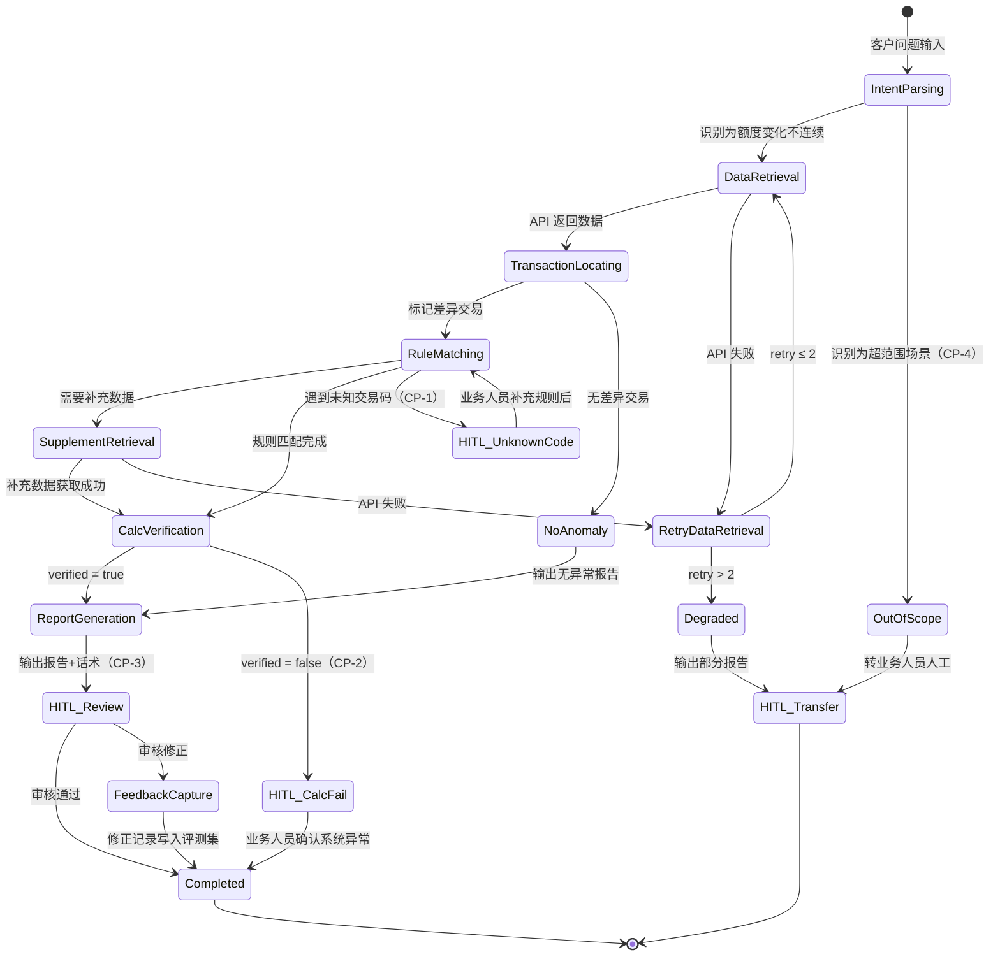

# 架构设计文档 — 额度异动排障 Agent

**版本**：v2.0
**日期**：2026-03-28
**前置输入**：P0-P2 harness_score.md（Q1, 清晰度 4/5, 验证自动化 4/5）；P1 综合调研；PRD agent_prd_limit_troubleshooting.md
**变更说明**：v1.0→v2.0 修正架构模式（ReAct→DAG+条件分支）、HITL 定位（外部→架构内）、工具集（8→7 收窄 MVP）、状态机（对齐 PRD）

---

## 1. 架构模式选型

### 决策路径

```
Q: 任务步骤是否在设计时可确定？
A: 是。PRD Core Workflow 定义了 7 步固定骨架：
   意图识别→数据检索→交易定位→规则匹配→[补充检索]→计算验证→报告生成。
   步骤 5（补充检索）是条件触发，但触发条件在设计时可穷举
   （anomaly 类型需要 CCA 交易详情时触发）。

Q: 步骤间是否需要动态判断/条件分支？
A: 是。交易定位后根据 anomaly 类型分支：
   - 差异交易（diff ≠ 0）→ 规则匹配
   - 无差异交易 → 直接生成无异常报告
   规则匹配后：
   - 未知交易码 → HITL CP-1
   - 需要补充数据 → 补充检索
   - 规则匹配完成 → 计算验证

Q: 分支逻辑是否可编程表达？
A: 是。所有分支条件均可编程判断：
   - diff ≠ 0 → 数值比较
   - 交易码是否在规则库中 → 查表
   - 是否需要补充数据 → anomaly 类型枚举
   - verified == true/false → 布尔判断
→ 分支逻辑可编程 → Workflow DAG

Q: 操作是否涉及不可逆/高风险行为？
A: 否。全部为只读查询 + 生成报告。
   但 MVP 阶段所有输出需业务人员审核（Supervised Autonomy），
   HITL 是确定性 checkpoint，不是风险触发。
→ Workflow DAG + HITL（Supervised Autonomy）
```

### 选型：Workflow DAG + 条件分支 + HITL Checkpoints

**v1.0 误判复盘**：v1.0 将 P0 案例中"步骤 4 发现需要新数据后触发步骤 5"解读为 ReAct 式的开放探索。PRD 的 Core Workflow 澄清了这一点——补充检索是已知的条件分支（规则匹配发现需要 CCA 交易详情时触发），不是 Agent 自主决定的探索行为。分支条件在设计时可穷举，属于分支状态机模式（参考文档 state-machine-patterns.md 模式 3），不需要 ReAct 的开放推理循环。

**选型理由**：排障流程是顺序型 DAG，7 步逐步依赖（PRD Section 4）。LLM 负责意图识别和话术生成等语义理解环节，但流程编排由确定性代码控制。4 个 HITL checkpoint 是架构组成部分（CP-1 未知交易码、CP-2 计算验证失败、CP-3 输出审核、CP-4 超范围场景），确保 Supervised Autonomy 策略在架构层面强制执行。

**不选其他模式的理由**：

- 不选 ReAct Loop：所有分支条件可编程表达，不需要 LLM 自主决定执行路径。ReAct 的开放循环引入不必要的不确定性，对确定性要求极高的金融排障场景是负面因素。
- 不选 Multi-Agent：单一领域，7 工具在限额内（≤10），排障流程严格顺序依赖，无并行收益。
- 不选独立 Critic Loop：验证已内嵌为 `skill_limit_calc_verify`（数学对账），额外 Critic 是冗余，增加 2× 延迟。

**[ASSUMPTION]**：假设所有数据查询 API 是同步返回的（秒级响应）。异步 API 需要引入等待状态。

---

## 2. 状态机设计

### 分支状态机（对齐 PRD Appendix A）



### 状态说明表

| 状态 | 进入条件 | 退出条件（成功） | 退出条件（失败/分支） | 超时 |
|------|---------|----------------|---------------------|------|
| IntentParsing | 接收客户问题（账户号+额度节点+问题描述+时间范围） | 提取出：问题类型、账户号、额度节点、时间范围 | 识别为超范围场景→OutOfScope | 10s |
| DataRetrieval | 意图解析成功 | 获取到交易明细（含可用额度前后值） | API 失败→RetryDataRetrieval | 15s |
| RetryDataRetrieval | API 调用失败 | 重试成功→DataRetrieval | retry>2→Degraded | 指数退避 |
| TransactionLocating | 交易数据获取成功 | 标记 diff≠0 的差异交易→RuleMatching | 无差异交易→NoAnomaly | 10s |
| RuleMatching | 存在差异交易 | 所有差异交易规则匹配完成→CalcVerification | 未知交易码→HITL_UnknownCode；需补充数据→SupplementRetrieval | 15s |
| SupplementRetrieval | 规则匹配需要 CCA 交易详情 | 补充数据获取成功→CalcVerification | API 失败→RetryDataRetrieval | 15s |
| CalcVerification | 规则匹配完成 | verified=true→ReportGeneration | verified=false→HITL_CalcFail | 10s |
| ReportGeneration | 验证通过 或 无异常 | 输出报告→HITL_Review | — | 15s |
| HITL_Review | 报告生成完成（CP-3 强制触发） | 审核通过→Completed | 审核修正→FeedbackCapture | 8h→标记「待审核」 |
| HITL_UnknownCode | 交易码未命中规则库（CP-1） | 业务人员补充规则→RuleMatching | — | 4h→标记「待规则补充」 |
| HITL_CalcFail | 计算验证不通过（CP-2） | 业务人员确认→Completed | — | 4h→升级开发排查 |
| OutOfScope | 识别到超范围场景（CP-4） | →HITL_Transfer | — | — |
| Degraded | API 重试超限 | 输出部分报告→HITL_Transfer | — | 5s |
| FeedbackCapture | 审核修正 | 修正写入评测集→Completed | — | — |

### 终止条件

```
【成功终止】
条件：CalcVerification verified=true 且 HITL_Review 审核通过。
输出：结构化根因分析报告 + 客户解释话术草稿。

【HITL 终止】
CP-1 未知交易码：暂停等待业务人员补充规则，补充后恢复 RuleMatching。
CP-2 计算验证失败：标记为疑似系统异常，转业务人员确认。
CP-3 输出审核：MVP 阶段强制触发，所有输出需审核。
CP-4 超范围场景：识别后直接转交，Agent 不处理。

【降级终止】
触发：API 重试超限（>2 次）。
输出：已收集的原始数据 + 已完成的分析步骤 + 失败点描述。
恢复时间目标：降级报告 5 秒内输出。

【总耗时上限】
120 秒（不含 HITL 等待时间），超时中止并输出部分报告。
```

### HITL Checkpoint 设计（对齐 PRD Section 5）

| Checkpoint | 触发条件 | 类型 | 人工决策内容 | 超时/默认动作 |
|------------|---------|------|------------|-------------|
| CP-1 | 交易码未命中规则库 | 确定性 | 补充业务规则解释 | 4h→标记「待规则补充」 |
| CP-2 | expected ≠ actual 且差值 > 0.01 | 确定性 | 判定是否为系统异常 | 4h→升级开发排查 |
| CP-3 | 每次排障完成 | 强制（MVP） | 确认报告准确性+话术可用性 | 8h→标记「待审核」 |
| CP-4 | 识别到境外交易/汇率/临额等超范围场景 | 确定性 | 接管完整排障 | — |

**Escalation 信息格式**：每个 checkpoint 提交 `{问题摘要, 已收集数据, 已完成分析, 需要人工决策的具体点, 可选方案}`，通过 `POST /api/escalation/{task_id}` 回调。

### 质量检查清单

- [x] **所有状态可达**：从 IntentParsing 出发可达所有 14 个状态
- [x] **所有状态有出口**：无死锁，每个非终态都有至少一个出口
- [x] **错误路径完整**：API 失败→重试→降级；未知交易码→HITL；验证失败→HITL；超范围→转交
- [x] **终止条件明确**：成功终止（verified + 审核通过）、4 类 HITL 终止、降级终止
- [x] **超时机制存在**：自动步骤秒级超时；HITL 步骤小时级超时+默认动作
- [x] **状态数量合规**：14 个状态（含 2 个终态），在 DAG+HITL 推荐上限（12）附近。FeedbackCapture 和 NoAnomaly 为轻量过渡态，可接受。

---

## 3. 上下文分层设计

### 层 1：常驻层（≤500 tokens 目标）

```
你是信用卡额度异常排障专家 Agent。

角色：根据客户描述的额度变化疑问，自动完成数据检索→交易定位→规则匹配→计算验证→根因报告生成。

输出格式：
1. 根因分析报告（结构化 JSON）
2. 客户解释话术（自然语言）

绝对约束：
- 禁止编造交易数据或业务规则，所有结论必须基于工具返回的实际数据
- 计算验证不通过时，禁止输出「已解释」，必须标记为「待人工确认」
- 遇到未知交易码，禁止猜测业务含义，必须触发 HITL
- 每步操作必须记录到排障日志

成功标准：Agent 推导的额度变化公式计算结果 = 实际额度变动值（误差 ≤ 0.01 元）
```

### 层 2：按需加载层（Skills，对齐 PRD Section 7）

| Skill | 描述（常驻） | 触发条件 | 预估 tokens |
|-------|-------------|---------|------------|
| `tx_code_rule_library` | 交易码→业务含义→额度使用规则的映射库 | 遇到需要匹配交易码业务含义时 | ~800 |
| `overpayment_logic` | 溢缴款判定和额度影响逻辑 | 识别到贷方入账金额 > 欠款冲抵金额时 | ~400 |
| `limit_recovery_rules` | 各交易类型对不同额度节点的额度恢复规则 | 需要判定交易是否恢复额度时 | ~600 |
| `explanation_template` | 客户解释话术生成模板 | 生成客户解释话术时 | ~300 |

**v1.0→v2.0 变更**：移除 `cross-account-analysis` 和 `hidden-factor-check`——多账户联动和汇率/临额/授权过期均为 PRD 明确的 Out-of-scope（MVP），对应 CP-4 直接转交。Skill 从 5 个收窄到 4 个，与 MVP 范围严格对齐。

### 层 3：运行时注入层（≤200 tokens/轮）

```xml
<runtime>
  <task_id>{排障任务 ID}</task_id>
  <customer_id>{客户号}</customer_id>
  <account_id>{账户号}</account_id>
  <account_type>{专享消费分期卡}</account_type>
  <limit_node>{消费额度/非循环专享消费分期额度}</limit_node>
  <time_range>{2025-12-20 ~ 2025-12-30}</time_range>
  <problem_description>{客户原始问题描述}</problem_description>
  <current_step>{当前排障步骤}</current_step>
</runtime>
```

### 层 4：记忆层

| 记忆类型 | 存储 | 写入时机 | 读取时机 |
|---------|------|---------|---------|
| Working Memory（当前任务状态） | 任务状态文件（JSON） | 每个 Step 完成后 | 每个 Step 开始前 |
| Procedural Memory（规则库更新） | Skills 文件 | CP-1 业务人员补充未知交易码规则后 | 规则匹配时按需加载 |
| Error Memory（失败案例） | 评测集文件 | CP-2 或 FeedbackCapture 触发后 | 定期 eval 时批量加载 |

**v1.0→v2.0 变更**：从"一期无状态"改为"任务级有状态"。每步结果外化到任务状态文件（JSON），不依赖 LLM 上下文窗口传递中间状态。这确保 HITL 恢复后（如 CP-1 补充规则后回到 RuleMatching）Agent 能从断点继续，而非从头执行。

### 层 5：系统层（代码/Hook 执行）

| 机制 | 实现方式 | 说明 |
|------|---------|------|
| 流程编排 | 确定性代码 | 状态机转换由代码控制，LLM 不决定执行路径 |
| 输出格式校验 | JSON Schema 验证 | 排障报告必须符合 trace_schema |
| 计算验证 | 确定性代码 | `f(params) == actual_change` 用代码执行，不让 LLM 做算术 |
| 重试退避 | 代码 Hook | 指数退避，max 2 次（对齐 PRD） |
| 总耗时熔断 | 代码 Hook | >120s 强制终止（不含 HITL 等待） |
| trace_id 注入 | Middleware | 所有 LLM 调用和工具调用挂载同一 trace_id |
| HITL 回调 | HTTP POST | `POST /api/escalation/{task_id}` 触发人工审核 |
| 未知交易码检测 | 查表（确定性） | 交易码不在规则库→CP-1，不靠 prompt 规则 |

**设计原则**："约束靠机制不靠期望"（反模式 AP-8）。计算验证、未知交易码检测、HITL 触发均为确定性代码逻辑，不依赖 LLM 遵循 prompt 指令。

---

## 4. 工具链概览（MVP，对齐 PRD Section 6）

| 工具 | 类别 | 操作类型 | 用途 | 对应步骤 |
|------|------|---------|------|---------|
| `query_limit_usage_detail` | API | Read | 额度使用明细查询（逐笔交易+额度变动） | Step 2 |
| `query_cca_transaction_detail` | API | Read | CCA 交易详情（TCL 节点、冲抵金额等） | Step 5 |
| `query_limit_view` | API | Read | 额度视图（各节点配置和额度值） | Step 5 |
| `query_actual_available_limit` | API | Read | 账户实际可用额度（含所有影响因素） | Step 5 |
| `skill_tx_continuity_check` | Skill | Compute | 交易连续性校验（逐笔 diff 计算） | Step 3 |
| `skill_limit_rule_match` | Skill | Compute | 额度规则匹配（交易码→业务含义→规则） | Step 4 |
| `skill_limit_calc_verify` | Skill | Compute | 额度计算验证（公式对账） | Step 6 |

**工具数量**：7 / 10 ✓

**v1.0→v2.0 变更**：移除 `parse_intent`（意图识别改为内置能力，非独立工具）、`query_rate_history`、`query_temp_quota_history`（Out-of-scope）、`generate_report`（报告生成为内置能力）。收窄到 4 API + 3 Skill = 7 工具，与 PRD Section 6 一致。

**v2 扩展预留**：`query_temp_limit_history`、`query_auth_expiry`（+2 = 9/10），在 Human Intervention Rate ≤ 20% 持续 4 周后引入。

---

## 5. 架构决策记录

| 决策 | 选项 | 结论 | 理由 | 版本 |
|------|------|------|------|------|
| 架构模式 | DAG / ReAct / Multi-Agent | **Workflow DAG + 条件分支** | 所有分支条件可编程表达（数值比较、查表、布尔判断），不需要 LLM 自主决定路径。v1.0 误判为 ReAct，已修正。 | v2.0 |
| HITL 定位 | 架构内 / 架构外 | **架构内 4 个 checkpoint** | CP-1~CP-4 均为确定性触发，是 Supervised Autonomy 的架构保障，非可选部署策略。v1.0 误判为架构外，已修正。 | v2.0 |
| 计算验证执行层 | LLM / 代码 | **代码（系统层）** | 数值精度零容忍，LLM 浮点运算不可靠 | v1.0 |
| 业务规则存储 | RAG / Skill / 常驻层 | **Skill（层 2）** | 规则数量有限但需精确匹配，Skill 比 RAG 更确定性 | v1.0 |
| 记忆层 | 无状态 / 任务级有状态 | **任务级有状态** | HITL 恢复需要断点续传，中间状态外化到 JSON 文件。v1.0"无状态"与 HITL 设计矛盾，已修正。 | v2.0 |
| 流程编排控制 | LLM 决策 / 代码控制 | **代码控制** | DAG 模式下状态转换由确定性代码驱动，LLM 只负责语义理解环节（意图识别、规则匹配推理、话术生成） | v2.0 |

---

## 6. Autonomy 演进路径（对齐 PRD Section 12）

| 阶段 | Autonomy Level | 变化 | Gate |
|------|---------------|------|------|
| **MVP** | Supervised | CP-3 强制触发，所有输出需审核 | Gold Dataset ≥ 30，Pass@10 ≥ 80% |
| **v2** | Expanded | CP-3 改为抽检（10% 随机 + 异常触发）；新增临额/授权过期场景 | HIR ≤ 20% 持续 4 周，Hallucination ≤ 3% |
| **v3** | Full | 一线客服可用，Agent 输出直接交付 | Pass@10 ≥ 95% 持续 8 周，Hallucination ≤ 1%，HIR ≤ 5% |

---

## 7. 待确认项

- [待确认] API 响应时间：所有数据查询 API 是否均为同步秒级返回？
- [待确认] 工具权限：Agent 调用的所有 API 是否使用同一服务账号？
- [待确认] 高频交易码覆盖率：4029/4306 等是否覆盖 MVP 场景 80%+ 的排障需求？
- [待确认] Qwen 系列模型对中文信用卡业务领域的推理能力是否满足需求（需 benchmark）
- [待确认] 排障日志存储方案与现有日志平台兼容性
