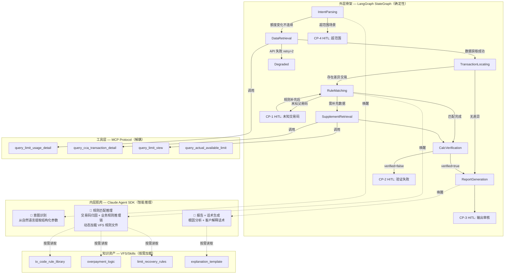
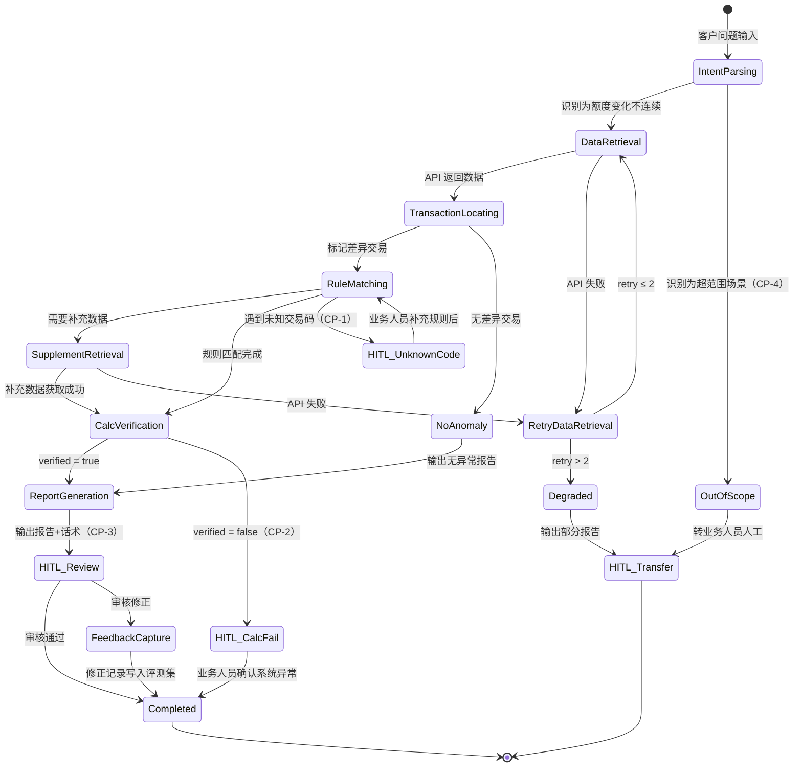

# 架构设计文档 — 额度异动排障 Agent

**版本**：v3.0
**日期**：2026-03-29
**前置输入**：P0-P2 harness_score.md；PRD agent_prd_limit_troubleshooting.md；R1-hybrid-orchestration.md；R2-memory-openviking.md
**变更说明**：v2.0→v3.0 架构模式从"纯 Workflow DAG"升级为"混合架构（Hybrid Orchestration）"——外层确定性骨架 + 内层智能节点。技术栈从单一 LangGraph 调整为 LangGraph + Claude Agent SDK + MCP。新增知识资产管理（VFS）和场景扩展策略。

---

## 1. 架构模式选型

### 核心矛盾

垂直领域（金融排障）Agent 的根本矛盾是：大模型的概率性发散（幻觉与失控）vs 领域对确定性的绝对要求（合规与精准）。纯 DAG 无法处理规则匹配中的复杂语义推理；纯 ReAct 无法保证流程合规和 HITL 触发。

### 决策路径

```
v1.0 路径：判定为 ReAct Loop（基于 P0 案例中"推理驱动的循环检索"）
  → 问题：流程确定性不足，HITL 触发依赖 prompt 而非代码

v2.0 路径：修正为 Workflow DAG（基于 PRD 证明所有分支条件可编程）
  → 问题：RuleMatching 节点内的推理复杂度被低估——交易码归因、
    溢缴款判定等涉及多步语义推理，硬编码所有 if-else 是徒劳的

v3.0 路径：混合架构（基于 R1 的控制流与执行流解耦原则）
  → 外层骨架：确定性状态机控制流程顺序、分支路由、HITL 触发
  → 内层肌肉：Agent SDK 在受控节点内做高自由度语义推理
  → 解决了确定性与灵活性的矛盾
```

### 选型：混合架构（Hybrid Orchestration）

**架构公式**（引用 R1）：

```
垂直领域 Agent = 确定性的流 (LangGraph)
              + 领域化的协议 (MCP)
              + 挂载的动态知识 (VFS/Skills)
              + 受控的智能节点 (Claude Agent SDK)
```

**选型理由**：

排障流程的 7 步骨架（意图识别→数据检索→交易定位→规则匹配→补充检索→计算验证→报告生成）是确定性的 SOP，必须由代码控制执行顺序和 HITL 触发——这是外层骨架的职责。但其中至少 3 个节点涉及复杂语义理解（意图识别从自然语言提取结构化参数；规则匹配将交易码归因到业务规则并推理额度影响；报告生成将分析结论转化为客户话术），这些节点内部的推理路径无法穷举，需要 LLM 的泛化能力——这是内层肌肉的职责。

**不选其他模式的理由**：

- 不选纯 Workflow DAG：v2.0 的方案。RuleMatching 节点的推理复杂度被低估——P0 案例中"识别 4306 交易码→查 TCL005 冲抵金额→推断溢缴款→匹配额度恢复规则"是多步语义推理链，不是简单的查表分支。硬编码此逻辑等同于穷举所有业务规则组合，违反 R1 的"将局部决策权交给大模型泛化能力"原则。
- 不选纯 Claude Agent SDK + Skill 约束：Skill 可以将 ReAct 收敛为近似 DAG（~95% 确定性），但不是物理保证。CP-1（未知交易码触发 HITL）和 CP-2（计算验证失败触发 HITL）必须在代码层强制执行，不能依赖 prompt 遵循。金融场景的合规审计要求流程本身 100% 确定和可追溯。
- 不选 Multi-Agent：单一领域，7 工具在限额内，无并行收益。

---

## 2. 双层架构设计

### 2.1 架构总览



### 2.2 节点分类：确定性 vs 智能

| 节点 | 执行层 | 理由 |
|------|-------|------|
| IntentParsing | **Agent SDK**（智能） | 从非结构化客户问题中提取账户号、额度节点、时间范围、疑问类型。输入格式不固定，需要语义理解。 |
| DataRetrieval | **代码**（确定性） | 根据解析结果调用 MCP 工具获取数据。入参确定，调用逻辑固定。 |
| TransactionLocating | **代码**（确定性） | 逐笔计算 diff = 可用额度后值 - 可用额度前值 - 交易金额。纯数值计算。 |
| RuleMatching | **Agent SDK**（智能） | 核心推理节点。需要将交易码映射到业务含义、推理额度影响规则、判断是否需要补充数据。P0 案例中 33% 的步骤是"检索知识库匹配规则"，这是本 Agent 最需要 LLM 泛化能力的环节。 |
| SupplementRetrieval | **代码**（确定性） | 调用 MCP 工具获取补充数据。由 RuleMatching 输出的结构化请求驱动。 |
| CalcVerification | **代码**（确定性） | `f(params) == actual_change` 纯数学验证。绝不能交给 LLM。 |
| ReportGeneration | **Agent SDK**（智能） | 将结构化分析结果转化为根因报告和客户解释话术。需要语言生成能力。 |
| 所有 HITL Checkpoint | **代码**（确定性） | CP-1~CP-4 的触发条件均由代码判断，物理保证触发。 |
| 重试/降级/超时 | **代码**（确定性） | 指数退避、熔断逻辑由 LangGraph StateGraph 控制。 |

### 2.3 内层智能节点设计

每个 Agent SDK 节点在受控沙盒内运行，拥有有限的自主权：

**IntentParsing 节点**

```
可用工具：无（纯 LLM 推理）
输入：客户问题原文
输出：结构化 JSON {account_id, account_type, limit_node, time_range, problem_type}
约束：如果无法提取 account_id 或 time_range，返回 {status: "incomplete", missing: [...]}
      由外层骨架决定是否转 OutOfScope
终止：单轮推理，无循环
```

**RuleMatching 节点**

```
可用工具：VFS 规则文件读取（tx_code_rule_library, overpayment_logic, limit_recovery_rules）
输入：差异交易列表 [{tx_code, amount, limit_before, limit_after, diff}]
输出：{matched_rules: [{tx_code, biz_meaning, rule, explanation}],
       unmatched: [tx_codes],
       supplement_needed: [{data_type, query_params}]}
工作模式：
  1. 读取 VFS 规则目录概览（L1 层），定位适用规则文件
  2. 按需读取具体规则文件（L2 层），逐笔交易匹配
  3. 对于无法直接匹配的交易，推理是否需要补充数据
约束：遇到未匹配交易码，必须放入 unmatched 数组返回（由外层骨架触发 CP-1）
      不允许猜测未知交易码的业务含义
循环上限：VFS 读取 ≤ 5 次
```

**ReportGeneration 节点**

```
可用工具：VFS 规则文件读取（explanation_template）
输入：完整分析结果（交易时间线+规则匹配+验证结果）
输出：{report: {根因分析 JSON}, explanation: {客户话术文本}}
约束：话术必须基于已验证的数据和规则，不允许添加未经验证的信息
终止：单轮生成，无循环
```

---

## 3. 状态机设计

状态机结构与 v2.0 一致（对齐 PRD Appendix A），变更点是节点的执行层归属。

### 分支状态机



### 状态说明表

（与 v2.0 一致，新增执行层标注）

| 状态 | 执行层 | 进入条件 | 退出条件（成功） | 退出条件（失败/分支） | 超时 |
|------|-------|---------|----------------|---------------------|------|
| IntentParsing | Agent SDK | 接收客户问题 | 提取出结构化参数 | 超范围→OutOfScope | 10s |
| DataRetrieval | 代码 | 意图解析成功 | 获取到交易明细 | API 失败→Retry | 15s |
| RetryDataRetrieval | 代码 | API 失败 | 重试成功 | retry>2→Degraded | 指数退避 |
| TransactionLocating | 代码 | 数据获取成功 | 标记差异交易 | 无差异→NoAnomaly | 10s |
| RuleMatching | Agent SDK | 存在差异交易 | 规则匹配完成 | 未知交易码→CP-1；需补充→Supplement | 30s |
| SupplementRetrieval | 代码 | 需要补充数据 | 获取成功 | API 失败→Retry | 15s |
| CalcVerification | 代码 | 规则匹配完成 | verified=true | verified=false→CP-2 | 10s |
| ReportGeneration | Agent SDK | 验证通过/无异常 | 输出报告 | — | 15s |
| HITL_Review | 代码 | 报告完成（CP-3） | 审核通过 | 修正→FeedbackCapture | 8h |
| HITL_UnknownCode | 代码 | 未知交易码（CP-1） | 规则补充后恢复 | — | 4h |
| HITL_CalcFail | 代码 | 验证失败（CP-2） | 业务人员确认 | — | 4h |

### 终止条件

与 v2.0 一致：成功终止（verified + 审核通过）、4 类 HITL 终止、降级终止、总耗时 120s 上限。

### 质量检查清单

- [x] 所有状态可达
- [x] 所有状态有出口
- [x] 错误路径完整
- [x] 终止条件明确
- [x] 超时机制存在
- [x] 状态数量合规（14 个，含 2 个终态）
- [x] **新增**：每个状态的执行层（代码/Agent SDK）已明确标注

---

## 4. 技术栈选型

### 四层技术栈

| 层 | 技术选型 | 职责 | 选型理由 |
|----|---------|------|---------|
| **控制流（骨架）** | LangGraph StateGraph | 状态机编排、条件路由、HITL interrupt、checkpoint 持久化 | 显式 DAG 定义，物理保证流程确定性和可审计性；内置 checkpointer 支持 HITL 断点续传；不锁定模型 |
| **工具协议** | MCP (Model Context Protocol) | 业务 API 封装为标准化 MCP Server | 极度解耦——工具资产不绑定特定框架；外层骨架和内层 Agent SDK 共享同一套 MCP 工具 |
| **知识资产（VFS）** | OpenViking 式分层规则文件 | 业务规则外化存储，按需加载 | 将记忆压力转化为检索动作（R2）；确定性路径寻址优于 RAG 模糊匹配；支持零代码热更新 |
| **智能节点（肌肉）** | Claude Agent SDK | 在受控节点内做语义推理 | 原生 skill 动态加载；session 持久化；tool_use 驱动的推理循环；hooks 机制做工具调用拦截验证 |

### LangGraph 与 Agent SDK 的协作模式

```python
# 伪代码：LangGraph 节点内唤醒 Agent SDK 实例
class RuleMatchingNode:
    """外层骨架的 RuleMatching 节点"""

    def __call__(self, state: GraphState) -> GraphState:
        # 1. 从 state 获取差异交易列表
        anomalies = state["anomalies"]

        # 2. 唤醒 Agent SDK 实例（受控沙盒）
        result = agent_sdk.query(
            prompt=f"对以下差异交易进行业务归因分析：{anomalies}",
            system_prompt=RULE_MATCHING_PROMPT,
            tools=[vfs_read_tool],          # 仅暴露 VFS 读取工具
            max_turns=5,                     # 循环上限
        )

        # 3. 代码层强制检查（约束靠机制不靠期望）
        if result.unmatched:
            state["hitl_trigger"] = "CP-1"  # 代码强制触发 HITL
        if result.supplement_needed:
            state["next_node"] = "SupplementRetrieval"
        else:
            state["next_node"] = "CalcVerification"

        state["matched_rules"] = result.matched_rules
        return state
```

关键设计点：Agent SDK 实例在每个节点内是**短生命周期**的——由外层骨架按需唤醒，执行完毕后销毁。状态通过 LangGraph 的 StateGraph 传递，不依赖 Agent SDK 的 session 跨节点延续。这确保了外层骨架对全局状态的完全控制权。

### MCP 工具共享

```
MCP Server: limit-troubleshooting-tools
├── query_limit_usage_detail    ← 外层骨架在 DataRetrieval 节点直接调用
├── query_cca_transaction_detail ← 外层骨架在 SupplementRetrieval 节点直接调用
├── query_limit_view            ← 外层骨架在 SupplementRetrieval 节点直接调用
├── query_actual_available_limit ← 外层骨架在 SupplementRetrieval 节点直接调用
└── vfs_read_rule               ← 内层 Agent SDK 在 RuleMatching 节点按需调用
```

收益：业务 API 资产建设一次，两层共享。未来如果内层从 Claude Agent SDK 切换到其他框架（如 Qwen + 自建推理引擎），MCP 工具层零改动。

### 知识资产 VFS 结构（引用 R2）

```
rules/
├── .overview                    # L1 层：全局规则路由地图
├── tx_codes/
│   ├── .overview                # L1 层：交易码分类索引
│   ├── installment_debit.md     # L2 层：分期借方入账规则（4029）
│   ├── installment_credit.md    # L2 层：分期贷方入账规则（4306）
│   └── ...
├── overpayment/
│   ├── .overview
│   └── overpayment_offset.md    # L2 层：溢缴款冲抵规则
├── limit_recovery/
│   ├── .overview
│   └── by_account_type.md       # L2 层：各账户类型额度恢复规则
└── templates/
    └── explanation_template.md   # L2 层：话术模板
```

Agent SDK 在 RuleMatching 节点内的工作模式：先读 `rules/.overview`（L1）定位适用域 → 下钻读取具体规则文件（L2） → 基于规则做归因推理。将记忆压力转化为确定性路径寻址（R2 核心原则），避免 RAG 的模糊匹配误命中。

业务规则热更新路径：业务人员通过 CP-1 补充新交易码规则时，直接在 `rules/tx_codes/` 下新增 L2 文件并更新 `.overview`，无需修改 Agent 代码或 Skill prompt。

---

## 5. 上下文分层设计

### 层 1：常驻层（≤500 tokens，Agent SDK 节点内的 system prompt）

```
你是信用卡额度异常排障专家。

职责：对给定的差异交易进行业务归因分析。

工作流程：
1. 读取 rules/.overview 定位适用规则域
2. 读取具体规则文件，逐笔匹配差异交易
3. 对无法直接匹配的交易，判断是否需要补充数据

绝对约束：
- 所有归因必须基于规则文件内容，禁止编造
- 未匹配的交易码放入 unmatched 数组返回，不猜测
- 输出格式：{matched_rules: [...], unmatched: [...], supplement_needed: [...]}

成功标准：每笔差异交易都有明确归因或标记为 unmatched
```

注意：这是内层 RuleMatching 节点的 system prompt，不是整个 Agent 的 system prompt。不同节点可以有不同的 system prompt，由外层骨架在唤醒时注入。

### 层 2：按需加载层（VFS 规则文件）

| 规则域 | L1 概览 | L2 文件数 | 预估 tokens/文件 |
|-------|---------|----------|----------------|
| 交易码规则库 | tx_codes/.overview | MVP 5-10 个 | ~200 |
| 溢缴款逻辑 | overpayment/.overview | 1-2 个 | ~400 |
| 额度恢复规则 | limit_recovery/.overview | 2-3 个 | ~300 |
| 话术模板 | templates/ | 1 个 | ~300 |

**Agent 单次加载量**：L1 概览 ~100 tokens + 命中的 L2 文件 ~200-400 tokens = **≤500 tokens/次**。远低于将全部规则塞入 prompt 的方案。

### 层 3：运行时注入层（≤200 tokens/轮）

由外层骨架在唤醒 Agent SDK 节点时注入：

```xml
<runtime>
  <task_id>{排障任务 ID}</task_id>
  <customer_id>{客户号}</customer_id>
  <account_id>{账户号}</account_id>
  <account_type>{专享消费分期卡}</account_type>
  <limit_node>{消费额度/非循环专享消费分期额度}</limit_node>
  <time_range>{2025-12-20 ~ 2025-12-30}</time_range>
  <current_step>{当前排障步骤}</current_step>
</runtime>
```

### 层 4：记忆层

| 记忆类型 | 存储 | 写入时机 | 读取时机 |
|---------|------|---------|---------|
| Working Memory | LangGraph StateGraph checkpoint | 每个节点执行后自动持久化 | HITL 恢复时自动加载 |
| Procedural Memory | VFS 规则文件 | CP-1 业务人员补充新规则后 | RuleMatching 节点按需读取 |
| Error Memory | 评测集文件 | CP-2 或 FeedbackCapture 触发后 | 定期 eval 时批量加载 |

**v2.0→v3.0 变更**：Working Memory 从"自建 JSON 文件"改为"LangGraph checkpoint"——StateGraph 原生支持状态持久化和断点恢复，无需额外建设。

### 层 5：系统层（代码/Hook 执行）

| 机制 | 实现位置 | 说明 |
|------|---------|------|
| 流程编排 | LangGraph StateGraph | 状态转换由 conditional_edges 代码控制 |
| HITL 触发 | LangGraph interrupt | CP-1~CP-4 由代码层 interrupt_before/after 强制执行 |
| 计算验证 | LangGraph 节点（确定性代码） | `f(params) == actual_change` |
| 未知交易码检测 | LangGraph 节点后置检查 | 检查 Agent SDK 返回的 unmatched 数组 |
| 重试退避 | LangGraph StateGraph | 指数退避，max 2 次 |
| 总耗时熔断 | LangGraph StateGraph | >120s 强制终止 |
| trace_id 注入 | LangGraph Middleware | 所有调用挂载同一 trace_id |
| 工具调用拦截 | Agent SDK hooks (PreToolUse) | 内层节点的工具调用可被拦截验证 |
| 输出格式校验 | Agent SDK hooks (PostToolUse) + JSON Schema | 验证 Agent SDK 节点返回结构 |

---

## 6. 工具链概览（MVP）

### MCP Tools（4 个 API）

| 工具 | 操作类型 | 调用方 | 用途 |
|------|---------|-------|------|
| `query_limit_usage_detail` | Read | 外层骨架 | 额度使用明细查询 |
| `query_cca_transaction_detail` | Read | 外层骨架 | CCA 交易详情 |
| `query_limit_view` | Read | 外层骨架 | 额度视图 |
| `query_actual_available_limit` | Read | 外层骨架 | 账户实际可用额度 |

### VFS Tools（1 个）

| 工具 | 操作类型 | 调用方 | 用途 |
|------|---------|-------|------|
| `vfs_read_rule` | Read | 内层 Agent SDK | 读取 VFS 规则文件（L1 概览 / L2 详情） |

### 确定性计算（2 个，非 LLM 工具）

| 工具 | 操作类型 | 调用方 | 用途 |
|------|---------|-------|------|
| `tx_continuity_check` | Compute | 外层骨架 | 逐笔 diff 计算 |
| `limit_calc_verify` | Compute | 外层骨架 | 额度变化公式对账 |

**工具总数**：4 MCP + 1 VFS + 2 Compute = 7 ✓

**v2 扩展预留**：`query_temp_limit_history`、`query_auth_expiry`（+2 MCP = 9）

---

## 7. 场景扩展策略

### 当前 MVP：单 workflow 覆盖"额度变化不连续"

当前 workflow 基于 1 条完整 SOP trace（分期卡溢缴款）+ 3 个典型场景描述抽象提炼。[ASSUMPTION] 提炼准确性依赖后续语料验证，已知盲区包括：分期借方入账的额度影响路径、不同额度节点的差异处理。

### 路径 A（近期）：场景路由 + 条件分支

当新场景类型（如临额过期、授权交易过期）纳入时，在 IntentParsing 后增加场景分类路由，不同场景走不同的 RuleMatching 规则域。VFS 的 L1/L2 分层天然支持这种扩展——新增场景只需在 `rules/` 下新增子目录和规则文件，RuleMatching 节点的 Agent SDK 通过 L1 概览自动路由到新域。

**升级信号**：场景类型 > 5 或 StateGraph 状态数 > 15 时触发路径 B 评估。

### 路径 B（远期）：多 workflow 编排

每个场景类型一个独立 StateGraph，由 orchestrator 路由。每个 worker graph 有自己的状态机和工具子集。LangGraph 的 graph composition 原生支持子图嵌套，无需换框架。

---

## 8. 架构决策记录

| 决策 | 选项 | 结论 | 理由 | 版本 |
|------|------|------|------|------|
| 架构模式 | 纯 DAG / 纯 ReAct / 混合 | **混合架构** | 控制流与执行流解耦——外层确定性保障合规审计，内层智能推理处理语义理解。v1.0→v2.0→v3.0 三次迭代收敛。 | v3.0 |
| 外层骨架 | LangGraph / 自建状态机 | **LangGraph** | 显式 DAG + conditional edges + interrupt（HITL）+ checkpointer（状态持久化）。原生覆盖 4 个核心需求。 | v3.0 |
| 内层肌肉 | Claude Agent SDK / LangGraph ReAct 节点 / Qwen + 自建 | **Claude Agent SDK** | 原生 skill 加载、hooks 拦截、session 管理。MVP 阶段优先验证推理质量。 | v3.0 |
| 工具协议 | MCP / 私有封装 | **MCP** | 解耦工具资产与框架绑定。外层和内层共享同一套工具。 | v3.0 |
| 知识管理 | RAG / Skill prompt 硬编码 / VFS | **VFS 分层规则文件** | 确定性路径寻址优于 RAG 模糊匹配；支持零代码热更新；将记忆压力转化为检索动作。 | v3.0 |
| HITL 定位 | 架构内 / 架构外 | **架构内 4 个 checkpoint** | 代码层物理保证触发。 | v2.0 |
| 计算验证 | LLM / 代码 | **代码（系统层）** | 数值精度零容忍。 | v1.0 |
| 记忆层 | 自建 JSON / LangGraph checkpoint | **LangGraph checkpoint** | StateGraph 原生支持，无需额外建设。 | v3.0 |

---

## 9. Autonomy 演进路径

| 阶段 | Autonomy Level | 变化 | Gate |
|------|---------------|------|------|
| **MVP** | Supervised | CP-3 强制触发；内层用 Claude Agent SDK | Gold Dataset ≥ 30，Pass@10 ≥ 80% |
| **v2** | Expanded | CP-3 改抽检；新增场景+工具；评估 Qwen 替代内层 | HIR ≤ 20% 持续 4 周，Hallucination ≤ 3% |
| **v3** | Full | 一线可用；如需多场景→路径 B 多 workflow | Pass@10 ≥ 95% 持续 8 周，HIR ≤ 5% |

### 模型策略

MVP 阶段内层使用 Claude Agent SDK（锁定 Claude 模型），优先验证推理质量。如果 Qwen 系列在 benchmark 中达到 RuleMatching 节点的准确率要求（交易码归因 ≥ 95%），v2 阶段评估将内层替换为 Qwen + LangGraph ReAct 节点，外层骨架和 MCP 工具层零改动。

---

## 10. 待确认项

- [待确认] API 响应时间：所有数据查询 API 是否均为同步秒级返回？
- [待确认] 工具权限：Agent 调用的所有 API 是否使用同一服务账号？
- [待确认] 高频交易码覆盖率：4029/4306 等是否覆盖 MVP 场景 80%+ 的排障需求？
- [待确认] Claude Agent SDK 在受控节点内的推理质量（需 benchmark：交易码归因准确率）
- [待确认] 排障日志存储方案与现有日志平台兼容性
- [待确认] VFS 规则文件的初始内容来源和维护责任人
