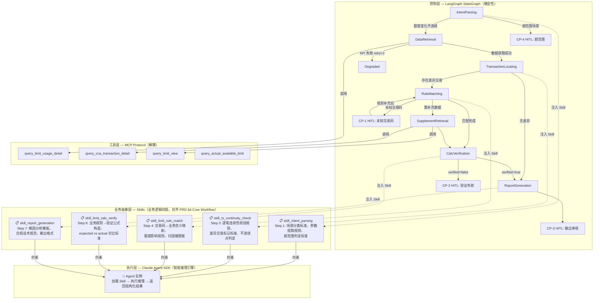
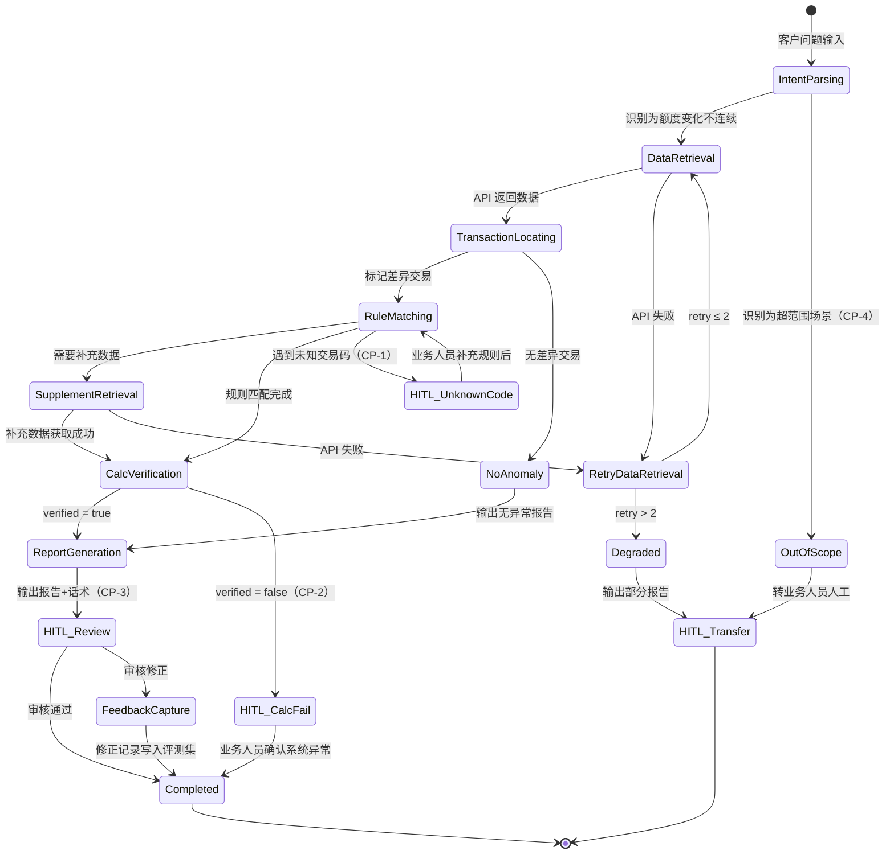

# 架构设计文档 — 额度异动排障 Agent

**版本**：v3.3
**日期**：2026-03-30
**前置输入**：P0-P2 harness_score.md；PRD agent_prd_limit_troubleshooting.md（特别是 §4 Core Workflow、§6 Toolchain Design）；R1-hybrid-orchestration.md；R2-memory-openviking.md
**变更说明**：v3.2→v3.3 针对 `skill_limit_rule_match` 的 OCP 问题做三项防腐设计：①§2.3 显式声明 Step 4 Skill I/O Contract（所有 Step 4 Skill 变体的输入输出契约）；②§4 伪代码从硬编码 Skill 名改为 `SKILL_ROUTING` 动态路由（基于 IntentParsing 的 problem_type）；③§7 路径 A 追加 TECH-DEBT 注释表，定义 Skill 命名/路由/校验/模板的重构触发信号。MVP 不改名不重构，但扩展路径已物理预埋。

v3.1→v3.2 Skill 分解从技术视角（哪些节点需要 Agent SDK）修正为业务工作流视角（对齐 PRD 7 步 Core Workflow）。Skill 从 3 个扩展为 5 个（新增 skill_tx_continuity_check、skill_limit_calc_verify），每个 Skill 单一职责对应一个 PRD Step。Step 3（交易连续性校验）和 Step 6（计算验证）从"确定性代码"升级为"Skill 驱动 + 代码二次校验"。

---

## 1. 架构模式选型

### 核心矛盾

垂直领域（金融排障）Agent 的根本矛盾是：大模型的概率性发散（幻觉与失控）vs 领域对确定性的绝对要求（合规与精准）。纯 DAG 无法处理规则匹配中的复杂语义推理；纯 ReAct 无法保证流程合规和 HITL 触发。

### 决策路径

```
v1.0 路径：判定为 ReAct Loop（基于 P0 案例中"推理驱动的循环检索"）
  → 问题：流程确定性不足，HITL 触发依赖 prompt 而非代码

v2.0 路径：修正为 Workflow DAG（基于 PRD 证明所有分支条件可编程）
  → 问题：RuleMatching 节点内的推理复杂度被低估——交易码归因、
    溢缴款判定等涉及多步语义推理，硬编码所有 if-else 是徒劳的

v3.0 路径：混合架构（基于 R1 的控制流与执行流解耦原则）
  → 控制层：确定性状态机控制流程顺序、分支路由、HITL 触发
  → 业务抽象层：Skill 文件封装业务规则和推理指引
  → 执行层：Agent SDK 在受控节点内加载 Skill 做语义推理
  → 解决了确定性与灵活性的矛盾
```

### 选型：混合架构（Hybrid Orchestration）

**架构公式**（引用 R1，v3.1 修正）：

```
垂直领域 Agent = 确定性的流 (LangGraph)         — 控制层：什么时候做
              + 业务逻辑封装 (Skills)            — 业务抽象层：怎么做
              + 领域化的协议 (MCP)               — 工具层：用什么接口
              + 受控的智能节点 (Claude Agent SDK)  — 执行层：用什么引擎跑
```

**选型理由**：

排障流程的 7 步（意图识别→数据检索→交易定位→规则匹配→补充检索→计算验证→报告生成）是确定性的 SOP，必须由代码控制执行顺序和 HITL 触发——这是控制层的职责。但其中至少 3 个节点涉及复杂语义理解（意图识别从自然语言提取结构化参数；规则匹配将交易码归因到业务规则并推理额度影响；报告生成将分析结论转化为客户话术），这些节点的推理路径无法穷举，需要 LLM 的泛化能力——这是执行层的职责。而指导执行层"怎么做"的业务规则和推理指引，则由业务抽象层（Skill）封装，确保业务逻辑变更不扩散到代码层。

**不选其他模式的理由**：

- 不选纯 Workflow DAG：v2.0 的方案。RuleMatching 节点的推理复杂度被低估——P0 案例中"识别 4306 交易码→查 TCL005 冲抵金额→推断溢缴款→匹配额度恢复规则"是多步语义推理链，不是简单的查表分支。硬编码此逻辑等同于穷举所有业务规则组合，违反 R1 的"将局部决策权交给大模型泛化能力"原则。
- 不选纯 Claude Agent SDK + Skill 约束：Skill 可以将 ReAct 收敛为近似 DAG（~95% 确定性），但不是物理保证。CP-1（未知交易码触发 HITL）和 CP-2（计算验证失败触发 HITL）必须在代码层强制执行，不能依赖 prompt 遵循。金融场景的合规审计要求流程本身 100% 确定和可追溯。
- 不选 Multi-Agent：单一领域，7 工具在限额内，无并行收益。

---

## 2. 三层架构设计

### 2.1 架构总览

架构从"双层"（控制流+执行流）升级为"三层"：在控制流与执行流之间插入**业务抽象层（Skill Layer）**。Skill 是业务逻辑的可执行封装——它不是 prompt engineering 技巧，而是将二线客服排障经验、业务规则判断标准、合规话术规范编码为 Agent 可理解的结构化指令。Skill 由业务方与工程师共建，是业务需求变更时的**主要变更面**。

```
三层职责边界：

控制层（LangGraph）  → "什么时候做、按什么顺序做" — 工程师维护
业务抽象层（Skills） → "怎么做、依据什么规则做" — 业务方+工程师共建
执行层（Agent SDK）  → "用什么引擎跑推理"       — 工程师维护
```



### 2.2 节点分类（对齐 PRD §4 Core Workflow 7 步）

| PRD Step | 节点 | 控制层 | 业务抽象层 | 执行层 | 说明 |
|----------|------|--------|-----------|--------|------|
| Step 1 | IntentParsing | LangGraph 路由 | `skill_intent_parsing` | Agent SDK | 从非结构化客户问题中提取结构化参数。场景分类标准和超范围判定由业务方定义于 Skill。 |
| Step 2 | DataRetrieval | LangGraph 代码 | — | 确定性代码 | 调用 MCP 工具获取交易明细。入参确定，调用逻辑固定。 |
| Step 3 | TransactionLocating | LangGraph 路由 | `skill_tx_continuity_check` | Agent SDK | 逐笔连续性校验+差异标记。虽含数值计算，但"什么算不连续""如何标记差异交易"是业务判断，由 Skill 定义。 |
| Step 4 | RuleMatching | LangGraph 路由 | `skill_limit_rule_match` | Agent SDK | 核心推理节点。交易码→业务含义→额度影响规则→归因推理链，全部由 Skill 封装。 |
| Step 5 | SupplementRetrieval | LangGraph 代码 | — | 确定性代码 | 由 RuleMatching 输出的结构化请求驱动 MCP 工具调用。 |
| Step 6 | CalcVerification | LangGraph 路由 | `skill_limit_calc_verify` | Agent SDK | 根据已匹配的业务规则**构造验证公式**，再执行 expected vs actual 对比。公式选择是业务逻辑，由 Skill 定义；数值对比由控制层代码二次校验。 |
| Step 7 | ReportGeneration | LangGraph 路由 | `skill_report_generation` | Agent SDK | 根因报告+客户话术。合规话术规范和输出格式标准由业务方定义于 Skill。 |
| — | HITL Checkpoints | LangGraph interrupt | — | 确定性代码 | CP-1~CP-4 触发条件由代码判断，物理保证触发。 |
| — | 重试/降级/超时 | LangGraph StateGraph | — | 确定性代码 | 指数退避、熔断逻辑。 |

**Step 6 CalcVerification 的双重保障**：Agent SDK 根据 Skill 中的规则构造公式并计算 expected 值，但最终的 `expected == actual` 数值比较由控制层代码执行（AP-8 约束靠机制不靠期望）。如果 Agent SDK 返回的公式结构不符合 JSON Schema，控制层直接拒绝并触发 CP-2。

### 2.3 Skill 定义（业务抽象层，对齐 PRD §6 Toolchain Design）

Skill 是业务逻辑的可执行封装，以文本文件形式存在。每个 Skill 文件包含：业务规则（what）、推理指引（how）、输出约束（format）、边界条件（when to escalate）。**业务方负责规则内容的准确性，工程师负责 Skill 文件的结构规范和加载机制。** 每个 Skill 遵循单一职责——对应 Core Workflow 中的一个明确步骤。

**skill_intent_parsing**（Step 1）

```
PRD 对应：Step 1 意图识别与问题拆分 [内置能力]
所有者：业务方+工程师共建
变更频率：低（场景分类标准相对稳定）
内容：
  - 场景分类标准：哪些客户问题属于"额度变化不连续"，哪些属于超范围
  - 参数提取规则：从哪些表述中识别账户号、额度节点、时间范围
  - 超范围判定标准：明确列举当前不支持的场景类型（如跨境额度、联名账户）
输出格式：{account_id, account_type, limit_node, time_range, problem_type}
边界条件：无法提取必要参数时返回 {status: "incomplete", missing: [...]}
```

**skill_tx_continuity_check**（Step 3）

```
PRD 对应：Step 3 定位问题交易 [Skill: transaction_continuity_check]
所有者：业务方+工程师共建
变更频率：低
内容：
  - 连续性校验规则：diff = 可用额度后值 - 可用额度前值 - 交易金额
  - 不连续点判定：前序交易后值 ≠ 后序交易前值的业务含义和标记标准
  - 差异交易分类：gap（不连续点）vs diff（单笔差异）的区分标准
  - 异常阈值：diff 在什么范围内算正常浮动（如分币舍入），什么范围算真实差异
输出格式：{anomalies: [{tx_index, type: "gap"|"diff", expected, actual, delta}]}
边界条件：无差异交易时返回空数组，由控制层路由至 NoAnomaly → Step 7
```

**skill_limit_rule_match**（Step 4，核心 Skill，复杂度最高）

```
PRD 对应：Step 4 业务归因分析 [Skill: limit_change_rule_match]
所有者：业务方主导，工程师辅助结构化
变更频率：高（新交易码、新业务规则持续补充）
内容：
  - 交易码业务含义映射：4029=分期借方入账、4306=分期贷方入账（冲抵）...
  - 额度影响判定逻辑：每种交易码对可用额度的影响方向和计算方式
  - 归因推理链模板：如"识别冲抵交易码→查冲抵金额→推断溢缴款→匹配额度恢复规则"
  - 补充数据判断标准：什么条件下需要调用额外 API 获取补充信息
输出格式：{matched_rules: [{tx_code, biz_meaning, limit_recovery_rule, explanation}],
           unmatched: [tx_codes], supplement_needed: [{data_type, query_params}]}
边界条件：遇到未匹配交易码，必须放入 unmatched 返回，不允许猜测业务含义
```

> **[TECH-DEBT] Step 4 Skill Contract — 场景扩展的 OCP 支点**
>
> 当前 `skill_limit_rule_match` 为"专项消费分期卡额度异动"场景定制。其内部推理链（交易码→业务含义→额度影响→归因）对其他场景（如临额过期、授权交易过期）不一定适用——这些场景的 Step 4 推理结构可能完全不同。
>
> **设计决策**：MVP 不做提前抽象（样本不足，过早抽象风险 > 命名不完美风险），但显式声明 **Step 4 Skill I/O Contract**，确保未来新增场景的 Skill 变体与控制层零耦合：
>
> ```
> Step 4 Skill Contract（所有 Step 4 Skill 变体必须遵循）:
>   Input:  {anomalies: [{tx_index, type, expected, actual, delta, raw_tx_data}]}
>   Output: {matched_rules: [{tx_code, biz_meaning, limit_impact_rule, explanation}],
>            unmatched: [tx_codes],
>            supplement_needed: [{data_type, query_params}]}
> ```
>
> **扩展方式**：新场景创建独立 Skill 文件（如 `skill_biz_attribution_temp_limit.md`），遵循同一 Contract，由控制层路由表分派。现有 `skill_limit_rule_match` 不需要改名——它是 Contract 的第一个实现，未来退化为 `SKILL_ROUTING["installment_limit_change"]` 的值。
>
> **触发重构信号**：场景类型 ≥ 3 时，评估是否将 Contract 升级为 JSON Schema 校验 + Skill 注册机制。

**skill_limit_calc_verify**（Step 6）

```
PRD 对应：Step 6 计算验证 [Skill: limit_calculation_verify]
所有者：业务方+工程师共建
变更频率：中（新规则需要新的验证公式）
内容：
  - 公式构造规则：根据 Step 4 匹配到的业务规则，选择对应的验证公式
    例：溢缴款冲抵场景 → expected = limit_before + offset_amount
    例：分期借方入账 → expected = limit_before - installment_amount
  - 验证判定标准：expected vs actual 的容差范围（如 ±0.01 元为舍入误差）
  - 多笔交易的累积验证：逐笔验证 vs 区间汇总验证的选择标准
输出格式：{verified: boolean, formula: string, expected: number, actual: number, diff: number}
边界条件：公式构造失败（无法匹配规则到公式）时返回 {verified: false, reason: "no_formula"}
```

**skill_report_generation**（Step 7）

```
PRD 对应：Step 7 生成根因分析 + 话术草稿 [内置能力]
所有者：业务方主导（话术合规要求）
变更频率：中（话术模板随合规要求调整）
内容：
  - 根因分析模板：结构化展示额度变动的完整因果链
  - 合规话术规范：哪些措辞可以/不可以对客户使用
  - 输出格式标准：{report: {根因分析 JSON}, explanation: {客户话术文本}}
边界条件：话术必须基于已验证的数据和规则，不允许添加未经验证的信息
```

### 2.4 执行约束（执行层）

执行层定义 Agent SDK 实例的运行时行为边界。与 Skill（业务逻辑）正交——Skill 变更不应导致执行约束变更，反之亦然。

| 智能节点 | PRD Step | 可用工具 | 循环上限 | 超时 | 说明 |
|---------|----------|---------|---------|------|------|
| IntentParsing | Step 1 | 无（纯 LLM 推理） | 1 轮 | 10s | 单轮提取，由控制层判断是否转 OutOfScope |
| TransactionLocating | Step 3 | 无（纯 LLM 推理） | 1 轮 | 10s | 基于 Skill 中的校验规则执行连续性判断 |
| RuleMatching | Step 4 | 无（MVP 规则内嵌 Skill） | ≤5 轮 | 30s | 核心推理节点，循环用于多笔交易逐笔匹配 |
| CalcVerification | Step 6 | 无（纯 LLM 推理） | 1 轮 | 10s | 公式构造由 Agent SDK，数值比较由控制层代码二次校验 |
| ReportGeneration | Step 7 | 无（纯 LLM 推理） | 1 轮 | 15s | 单轮生成 |

关键设计点：Agent SDK 实例在每个节点内是**短生命周期**的——由控制层按需唤醒，执行完毕后销毁。状态通过 LangGraph StateGraph 传递，不依赖 Agent SDK 的 session 跨节点延续。这确保了控制层对全局状态的完全控制权。

---

## 3. 状态机设计

状态机结构与 v2.0 一致（对齐 PRD Appendix A），变更点是节点的执行层归属。

### 分支状态机



### 状态说明表

（与 v2.0 一致，执行层标注表示运行时引擎。Agent SDK 节点均通过 Skill 文件获取业务逻辑，详见 §2.3）

| 状态 | 执行层 | 进入条件 | 退出条件（成功） | 退出条件（失败/分支） | 超时 |
|------|-------|---------|----------------|---------------------|------|
| IntentParsing | Agent SDK | 接收客户问题 | 提取出结构化参数 | 超范围→OutOfScope | 10s |
| DataRetrieval | 代码 | 意图解析成功 | 获取到交易明细 | API 失败→Retry | 15s |
| RetryDataRetrieval | 代码 | API 失败 | 重试成功 | retry>2→Degraded | 指数退避 |
| TransactionLocating | Agent SDK (Skill) | 数据获取成功 | 标记差异交易 | 无差异→NoAnomaly | 10s |
| RuleMatching | Agent SDK | 存在差异交易 | 规则匹配完成 | 未知交易码→CP-1；需补充→Supplement | 30s |
| SupplementRetrieval | 代码 | 需要补充数据 | 获取成功 | API 失败→Retry | 15s |
| CalcVerification | Agent SDK (Skill) + 代码二次校验 | 规则匹配完成 | verified=true | verified=false→CP-2 | 10s |
| ReportGeneration | Agent SDK | 验证通过/无异常 | 输出报告 | — | 15s |
| HITL_Review | 代码 | 报告完成（CP-3） | 审核通过 | 修正→FeedbackCapture | 8h |
| HITL_UnknownCode | 代码 | 未知交易码（CP-1） | 规则补充后恢复 | — | 4h |
| HITL_CalcFail | 代码 | 验证失败（CP-2） | 业务人员确认 | — | 4h |

### 终止条件

与 v2.0 一致：成功终止（verified + 审核通过）、4 类 HITL 终止、降级终止、总耗时 120s 上限。

### 质量检查清单

- [x] 所有状态可达
- [x] 所有状态有出口
- [x] 错误路径完整
- [x] 终止条件明确
- [x] 超时机制存在
- [x] 状态数量合规（14 个，含 2 个终态）
- [x] **新增**：每个状态的执行层（代码/Agent SDK）已明确标注

---

## 4. 技术栈选型

### 技术栈

| 层 | 技术选型 | 职责 | 选型理由 |
|----|---------|------|---------|
| **控制层** | LangGraph StateGraph | 状态机编排、条件路由、HITL interrupt、checkpoint 持久化 | 显式 DAG 定义，物理保证流程确定性和可审计性；内置 checkpointer 支持 HITL 断点续传；不锁定模型 |
| **业务抽象层** | Skill 文本文件 | 业务逻辑封装：规则定义、推理指引、输出约束、边界条件 | 业务方可直接审核和修改；变更不需要改代码或状态机；是业务需求变更时的主要变更面 |
| **工具协议** | MCP (Model Context Protocol) | 业务 API 封装为标准化 MCP Server | 极度解耦——工具资产不绑定特定框架；控制层和执行层共享同一套 MCP 工具 |
| **执行层** | Claude Agent SDK | 在受控节点内加载 Skill 做语义推理 | 原生 tool_use 驱动的推理循环；hooks 机制做工具调用拦截验证；MVP 阶段优先验证推理质量 |

### 三层协作模式

```python
# 伪代码：控制层 → 加载 Skill → 唤醒执行层
class RuleMatchingNode:
    """控制层的 RuleMatching 节点"""

    def __call__(self, state: GraphState) -> GraphState:
        anomalies = state["anomalies"]

        # 1. 加载业务抽象层：基于场景分类动态路由 Skill（OCP 支点）
        #    路由表新增一行 = 支持一个新场景，RuleMatchingNode 本身不改
        SKILL_ROUTING = {
            "installment_limit_change": "skill_limit_rule_match",
            # 未来扩展示例（当前未实现）：
            # "temp_limit_expiry":       "skill_biz_attribution_temp_limit",
            # "auth_tx_expiry":          "skill_biz_attribution_auth_expiry",
        }
        skill_name = SKILL_ROUTING[state["problem_type"]]
        skill_content = load_skill(skill_name)

        # 2. 唤醒执行层：Agent SDK 实例（受控沙盒）
        result = agent_sdk.query(
            prompt=f"对以下差异交易进行业务归因分析：{anomalies}",
            system_prompt=skill_content,     # Skill 即 system prompt
            tools=[],                        # MVP 阶段规则内嵌于 Skill，无需外部工具
            max_turns=5,
        )

        # 3. 控制层强制检查（约束靠机制不靠期望 AP-8）
        if result.unmatched:
            state["hitl_trigger"] = "CP-1"
        if result.supplement_needed:
            state["next_node"] = "SupplementRetrieval"
        else:
            state["next_node"] = "CalcVerification"

        state["matched_rules"] = result.matched_rules
        return state
```

**Skill 加载机制**：控制层在唤醒 Agent SDK 实例前，从文件系统读取对应 Skill 文本文件，作为 system_prompt 注入。MVP 阶段路由表为代码内 dict（`SKILL_ROUTING`），由 IntentParsing 输出的 `problem_type` 索引。新增场景只需：①新建 Skill 文件（遵循 Step 4 Skill Contract）②路由表加一行。控制层节点代码不改。

### MCP 工具共享

```
MCP Server: limit-troubleshooting-tools
├── query_limit_usage_detail    ← 控制层在 DataRetrieval 节点直接调用
├── query_cca_transaction_detail ← 控制层在 SupplementRetrieval 节点直接调用
├── query_limit_view            ← 控制层在 SupplementRetrieval 节点直接调用
└── query_actual_available_limit ← 控制层在 SupplementRetrieval 节点直接调用
```

收益：业务 API 资产建设一次，控制层和执行层均可共享。未来如果执行层从 Claude Agent SDK 切换到其他框架（如 Qwen + 自建推理引擎），MCP 工具层零改动。

### MVP 知识管理：Skill 内嵌

MVP 阶段，业务规则直接写入 Skill 文本文件中，不引入独立的知识管理层。理由：当前业务规则体量有限（已知交易码 ~10 个，额度恢复规则 ~5 条），Skill 文件可以完整承载，无需额外的检索和路由机制。

```
skills/
├── skill_intent_parsing.md        # Step 1: 意图识别规范（含场景分类标准）
├── skill_tx_continuity_check.md   # Step 3: 交易连续性校验规则（含差异标记标准）
├── skill_limit_rule_match.md      # Step 4: 额度规则匹配（含交易码映射表、归因推理链）
├── skill_limit_calc_verify.md     # Step 6: 计算验证（含公式构造规则）
└── skill_report_generation.md     # Step 7: 报告生成规范（含合规话术模板）
```

业务规则更新路径：业务人员通过 CP-1 补充新交易码规则时，直接编辑 `skill_limit_rule_match.md` 的交易码映射表部分。无需修改 Agent 代码或状态机。

### 演进选项：VFS 分层知识管理

当 Skill 文件膨胀到影响推理质量时（信号：单个 Skill 文件 > 2000 tokens，或交易码规则 > 50 条），可引入 VFS 分层结构（参考 R2 OpenViking 模式）：将 Skill 文件中的静态知识（交易码映射表、规则库）拆分为 L1 概览 + L2 详情文件，Agent SDK 通过路径寻址按需加载。此时 Skill 文件退化为"推理指引+输出约束"，知识内容迁移至 VFS。这是架构演进决策，不是 MVP 范围。

---

## 5. 上下文分层设计

### 层 1：Skill 层（业务抽象，由控制层作为 system_prompt 注入）

MVP 阶段，Skill 文件即 system_prompt。每个智能节点加载对应的 Skill 文件，包含业务规则、推理指引、输出约束和边界条件。Skill 内容详见 §2.3。

| Skill 文件 | PRD Step | 对应节点 | 预估 tokens | 所有者 |
|-----------|----------|---------|------------|-------|
| `skill_intent_parsing.md` | Step 1 | IntentParsing | ~300 | 业务方+工程师 |
| `skill_tx_continuity_check.md` | Step 3 | TransactionLocating | ~300 | 业务方+工程师 |
| `skill_limit_rule_match.md` | Step 4 | RuleMatching | ~800（含交易码映射表） | 业务方主导 |
| `skill_limit_calc_verify.md` | Step 6 | CalcVerification | ~400（含公式构造规则） | 业务方+工程师 |
| `skill_report_generation.md` | Step 7 | ReportGeneration | ~500（含话术模板） | 业务方主导 |

**Context Rot 防治**：单个 Skill 文件上限 2000 tokens。超限时触发 VFS 拆分评估（见 §4 演进选项）。

### 层 2：运行时注入层（≤200 tokens/轮）

由控制层在唤醒 Agent SDK 节点时注入：

```xml
<runtime>
  <task_id>{排障任务 ID}</task_id>
  <customer_id>{客户号}</customer_id>
  <account_id>{账户号}</account_id>
  <account_type>{专享消费分期卡}</account_type>
  <limit_node>{消费额度/非循环专享消费分期额度}</limit_node>
  <time_range>{2025-12-20 ~ 2025-12-30}</time_range>
  <current_step>{当前排障步骤}</current_step>
</runtime>
```

### 层 3：记忆层

| 记忆类型 | 存储 | 写入时机 | 读取时机 |
|---------|------|---------|---------|
| Working Memory | LangGraph StateGraph checkpoint | 每个节点执行后自动持久化 | HITL 恢复时自动加载 |
| Procedural Memory | Skill 文件 | CP-1 业务人员补充新规则后编辑 Skill 文件 | 控制层唤醒节点时加载 |
| Error Memory | 评测集文件 | CP-2 或 FeedbackCapture 触发后 | 定期 eval 时批量加载 |

Working Memory 使用 LangGraph checkpoint——StateGraph 原生支持状态持久化和断点恢复，无需额外建设。

### 层 4：系统层（代码/Hook 执行）

| 机制 | 实现位置 | 说明 |
|------|---------|------|
| 流程编排 | LangGraph StateGraph | 状态转换由 conditional_edges 代码控制 |
| HITL 触发 | LangGraph interrupt | CP-1~CP-4 由代码层 interrupt_before/after 强制执行 |
| 计算验证 | LangGraph 节点（确定性代码） | `f(params) == actual_change` |
| 未知交易码检测 | LangGraph 节点后置检查 | 检查 Agent SDK 返回的 unmatched 数组 |
| 重试退避 | LangGraph StateGraph | 指数退避，max 2 次 |
| 总耗时熔断 | LangGraph StateGraph | >120s 强制终止 |
| trace_id 注入 | LangGraph Middleware | 所有调用挂载同一 trace_id |
| 工具调用拦截 | Agent SDK hooks (PreToolUse) | 执行层节点的工具调用可被拦截验证 |
| 输出格式校验 | Agent SDK hooks (PostToolUse) + JSON Schema | 验证 Agent SDK 节点返回结构 |

---

## 6. 工具链概览（MVP）

### MCP Tools（4 个 API）

| 工具 | 操作类型 | 调用方 | 用途 |
|------|---------|-------|------|
| `query_limit_usage_detail` | Read | 控制层 | 额度使用明细查询 |
| `query_cca_transaction_detail` | Read | 控制层 | CCA 交易详情 |
| `query_limit_view` | Read | 控制层 | 额度视图 |
| `query_actual_available_limit` | Read | 控制层 | 账户实际可用额度 |

### Skill（5 个，业务逻辑封装）

| Skill | PRD Step | 执行方 | 用途 |
|-------|----------|-------|------|
| `skill_intent_parsing` | Step 1 | Agent SDK | 意图识别与问题拆分 |
| `skill_tx_continuity_check` | Step 3 | Agent SDK | 交易连续性校验+差异标记 |
| `skill_limit_rule_match` | Step 4 | Agent SDK | 交易码归因+业务规则匹配 |
| `skill_limit_calc_verify` | Step 6 | Agent SDK | 业务规则→验证公式构造+对比 |
| `skill_report_generation` | Step 7 | Agent SDK | 根因报告+合规话术生成 |

**MVP 工具总数**：4 MCP Tool + 5 Skill = 9（对齐 PRD §6 的 4 Tool + 3 Skill，新增 Step 1/7 的内置能力也显式 Skill 化后为 +2）

**CalcVerification 双重保障**：Agent SDK 通过 `skill_limit_calc_verify` 构造公式并返回 `{verified, formula, expected, actual, diff}`，控制层代码对 `expected == actual`（容差 ±0.01）做二次校验。两层结果不一致时触发 CP-2。

**v2 扩展预留**：`query_temp_limit_history`、`query_auth_expiry`（+2 MCP）；如引入 VFS，Skill 中的知识部分迁出为 VFS 文件，新增 `vfs_read_rule` 工具

---

## 7. 场景扩展策略

### 当前 MVP：单 workflow 覆盖"额度变化不连续"

当前 workflow 基于 1 条完整 SOP trace（分期卡溢缴款）+ 3 个典型场景描述抽象提炼。[ASSUMPTION] 提炼准确性依赖后续语料验证，已知盲区包括：分期借方入账的额度影响路径、不同额度节点的差异处理。

### 路径 A（近期）：场景路由 + Skill 扩展

当新场景类型（如临额过期、授权交易过期）纳入时，有两种扩展方式：

- **同构场景**（推理链结构相同，仅规则内容不同）：在 `skill_limit_rule_match.md` 中补充新交易码和规则。
- **异构场景**（推理链结构不同）：新建独立 Skill 文件（如 `skill_biz_attribution_temp_limit.md`），遵循 §2.3 定义的 **Step 4 Skill Contract**，在 `SKILL_ROUTING` 路由表中注册，由 IntentParsing 输出的 `problem_type` 决定加载哪个 Skill。

**升级信号**：场景类型 > 5 或 StateGraph 状态数 > 15 时触发路径 B 评估；单个 Skill 文件 > 2000 tokens 时触发 VFS 拆分评估。

> **[TECH-DEBT] Skill 扩展的已知限制与重构触发条件**
>
> | 项目 | 当前状态 | 触发重构信号 | 重构方向 |
> |------|---------|------------|---------|
> | Skill 命名 | `skill_limit_rule_match`（场景耦合命名） | 场景类型 ≥ 3 | 统一前缀 `skill_biz_attribution_*`，当前文件作为 `_installment` 变体 |
> | Skill 路由 | 代码内 dict `SKILL_ROUTING` | 场景类型 ≥ 5 或需要运行时热更新 | 迁移至配置文件或 Skill Registry 服务 |
> | Contract 校验 | 隐式（控制层 if 判断） | 场景类型 ≥ 3 或出现 Contract 违反导致的线上问题 | JSON Schema 校验 + 单元测试 |
> | Skill 内部结构 | 自由文本（无模板约束） | 异构 Skill ≥ 2 | 定义 Skill 模板：`## 推理链 / ## 规则表 / ## 输出约束 / ## 边界条件` |
>
> **决策依据**：MVP 阶段只有 1 个场景，抽象成本 > 收益。上述信号是"从具体到抽象"的自然演进节点，不是设计缺陷。

### 路径 B（远期）：多 workflow 编排

每个场景类型一个独立 StateGraph，由 orchestrator 路由。每个 worker graph 有自己的状态机和工具子集。LangGraph 的 graph composition 原生支持子图嵌套，无需换框架。

---

## 8. 架构决策记录

| 决策 | 选项 | 结论 | 理由 | 版本 |
|------|------|------|------|------|
| 架构模式 | 纯 DAG / 纯 ReAct / 混合 | **混合架构** | 控制流与执行流解耦——控制层确定性保障合规审计，执行层智能推理处理语义理解。v1.0→v2.0→v3.0 三次迭代收敛。 | v3.0 |
| 架构分层 | 双层（控制+执行）/ 三层（控制+业务抽象+执行） | **三层** | 业务逻辑作为独立 Skill Layer 存在，是需求变更的主要变更面。业务方可直接参与 Skill 共建和审核，不依赖工程师翻译。 | v3.1 |
| 控制层 | LangGraph / 自建状态机 | **LangGraph** | 显式 DAG + conditional edges + interrupt（HITL）+ checkpointer（状态持久化）。原生覆盖 4 个核心需求。 | v3.0 |
| 执行层 | Claude Agent SDK / LangGraph ReAct 节点 / Qwen + 自建 | **Claude Agent SDK** | tool_use 驱动的推理循环；hooks 拦截验证。MVP 阶段优先验证推理质量。 | v3.0 |
| 工具协议 | MCP / 私有封装 | **MCP** | 解耦工具资产与框架绑定。控制层和执行层共享同一套工具。 | v3.0 |
| MVP 知识管理 | RAG / Skill 内嵌 / VFS 分层 | **Skill 内嵌** | MVP 阶段规则体量有限（交易码 ~10，规则 ~5），Skill 文件可完整承载。VFS 作为演进选项，触发信号：单 Skill > 2000 tokens 或规则 > 50 条。 | v3.1 |
| HITL 定位 | 架构内 / 架构外 | **架构内 4 个 checkpoint** | 代码层物理保证触发。 | v2.0 |
| 计算验证 | LLM / 代码 | **代码（系统层）** | 数值精度零容忍。 | v1.0 |
| 记忆层 | 自建 JSON / LangGraph checkpoint | **LangGraph checkpoint** | StateGraph 原生支持，无需额外建设。 | v3.0 |

---

## 9. Autonomy 演进路径

| 阶段 | Autonomy Level | 变化 | Gate |
|------|---------------|------|------|
| **MVP** | Supervised | CP-3 强制触发；执行层用 Claude Agent SDK | Gold Dataset ≥ 30，Pass@10 ≥ 80% |
| **v2** | Expanded | CP-3 改抽检；新增场景+工具；评估 Qwen 替代执行层 | HIR ≤ 20% 持续 4 周，Hallucination ≤ 3% |
| **v3** | Full | 一线可用；如需多场景→路径 B 多 workflow | Pass@10 ≥ 95% 持续 8 周，HIR ≤ 5% |

### 模型策略

MVP 阶段执行层使用 Claude Agent SDK（锁定 Claude 模型），优先验证推理质量。如果 Qwen 系列在 benchmark 中达到 RuleMatching 节点的准确率要求（交易码归因 ≥ 95%），v2 阶段评估将执行层替换为 Qwen + LangGraph ReAct 节点，控制层、Skill 层和 MCP 工具层零改动。

---

## 10. 变更面分析（Change Surface Analysis）

三层架构的核心收益是**变更隔离**：不同类型的需求变更应该落在不同的架构层，不扩散。

### 变更类型与变更面映射

| 变更类型 | 典型场景 | 主要变更面 | 是否需要改代码 | 是否需要改状态机 |
|---------|---------|-----------|-------------|--------------|
| **新增业务规则** | 新交易码上线、额度恢复规则调整 | Skill 文件 | 否 | 否 |
| **调整合规话术** | 监管要求变更、话术模板更新 | Skill 文件 | 否 | 否 |
| **扩展场景分类** | 新增"临额过期"场景 | Skill 文件 + 控制层路由 | 可能（新增路由分支） | 可能（新增状态） |
| **新增数据源** | 接入新 API（如临额历史查询） | MCP 工具 + 控制层节点 | 是 | 可能 |
| **替换推理引擎** | Claude → Qwen | 执行层配置 | 是 | 否 |
| **流程顺序调整** | 先验证再匹配 | 控制层状态机 | 是 | 是 |

### 设计原则

**高频变更落在低代码层**。业务规则变更和话术调整是最高频的需求（预估月级），这些变更完全落在 Skill 文件层，业务方可直接编辑，不需要工程师介入，不需要重新部署。流程结构调整是最低频的需求（预估季度级），落在控制层和状态机，需要工程师参与。

**Skill 是业务方与工程团队的协作界面**。业务方负责 Skill 内容的业务准确性（交易码含义、规则逻辑、话术合规），工程师负责 Skill 的结构规范（输出格式、边界条件定义）和加载机制。这个分工使得业务需求变更的响应路径最短。

---

## 11. 待确认项

- [待确认] API 响应时间：所有数据查询 API 是否均为同步秒级返回？
- [待确认] 工具权限：Agent 调用的所有 API 是否使用同一服务账号？
- [待确认] 高频交易码覆盖率：4029/4306 等是否覆盖 MVP 场景 80%+ 的排障需求？
- [待确认] Claude Agent SDK 在受控节点内的推理质量（需 benchmark：交易码归因准确率）
- [待确认] 排障日志存储方案与现有日志平台兼容性
- [待确认] Skill 文件的初始内容来源——业务方是否能提供结构化的交易码规则和话术规范，还是需要从工单中提炼
