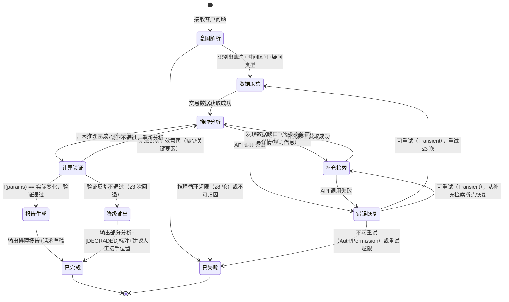

# 架构设计文档 — 额度异动排障 Agent

**版本**：v1.0
**日期**：2026-03-28
**前置输入**：P0-P2 harness_score.md（Q1, 清晰度 4/5, 验证自动化 4/5）；P1 综合调研

---

## 1. 架构模式选型

### 决策路径

```
Q: 任务步骤是否在设计时可确定？
A: 部分可确定。排障主流程（意图识别→数据检索→交易定位→规则匹配→计算验证→话术生成）的六阶段骨架固定，但：
   - 规则匹配阶段可能需要多轮数据检索（P0 案例中步骤 4→5→6→7 形成了循环）
   - 不同场景类型（6 类）在"交易定位"后的分析路径不同
→ 不是纯线性，有条件分支和可能的循环

Q: 步骤间是否需要动态判断/条件分支？
A: 是。交易定位后，Agent 需要判断偏差类型（单笔差异 vs 相邻不连续 vs 隐性变动），不同偏差走不同分析路径。

Q: 分支逻辑是否可编程表达？
A: 部分可以。偏差类型分类（数值比较）可编程，但规则匹配和归因推理需要 LLM 语义理解。
→ 需要 LLM 判断 → ReAct Loop 候选
```

### 选型：ReAct Loop

**选型理由**：排障本质是诊断问题——Agent 获取数据后需要推理偏差原因，推理结果可能触发新的数据检索需求（P0 案例中 4306 交易的详情查询就是推理驱动的），这正是 ReAct 的核心模式。六阶段骨架作为 Agent 的 system prompt 指导思路，但执行路径由推理结果动态决定。

**不选其他模式的理由**：

- 不选 Workflow DAG：P0 案例证明排障不是线性流水线——步骤 4 发现需要新数据后触发了步骤 5 的额外检索，这种"推理→发现缺口→补充检索→继续推理"的循环是 DAG 无法表达的。
- 不选 Multi-Agent：当前只涉及额度排障单一领域，不存在需要并行的多领域专家。工具集预计 5-8 个，远未触及 Multi-Agent 的引入门槛（>10 工具 + 多业务域）。
- 不选 Human-in-Loop（作为架构模式）：Agent 定位为"二线客服加速器"，输出供人工审核后使用，但审核发生在 Agent 流程之外（客服阅读报告后决定是否采纳），不是流程内的暂停-等待节点。HITL 是部署策略而非架构组件。

**[ASSUMPTION]**：假设所有数据查询 API 是同步返回的（秒级响应），不需要异步等待机制。如果存在异步 API（如跨系统查询需要分钟级等待），需引入等待状态，架构可能演化为 ReAct + 异步回调。

---

## 2. 状态机设计

### Think-Act-Observe 循环（额度排障定制版）



### 状态说明表

| 状态 | 进入条件 | 退出条件（成功） | 退出条件（失败） | 超时 |
|------|---------|----------------|----------------|------|
| 意图解析 | 接收客户问题文本 | 提取出：账户类型、额度节点、时间区间、疑问类型 | 缺少 2 个以上关键要素 | 10s |
| 数据采集 | 意图解析成功 | 获取到指定区间内的交易明细（含可用额度前后值） | API 返回错误 | 15s |
| 推理分析 | 有交易数据可分析 | 完成偏差项识别和业务归因 | 循环 ≥8 轮仍无法归因 | 30s/轮 |
| 补充检索 | 推理发现数据缺口 | 获取到补充数据 | API 返回错误 | 15s |
| 计算验证 | 归因完成 | 计算结果与实际变化一致 | 3 次回退后仍不一致 | 10s |
| 报告生成 | 验证通过 | 输出结构化报告 | — | 15s |
| 降级输出 | 验证反复失败 | 输出部分结果+降级标注 | — | 10s |
| 错误恢复 | API 调用失败 | 重试成功 | 不可重试或超限 | 按指数退避 |

### 终止条件

```
【成功终止】
条件：计算验证通过——Agent 推导的额度变化公式能精确还原客户感知的每一步额度值。
输出：结构化排障报告（交易时间线+逐笔分析+归因说明+验证结果+话术草稿）。

【失败终止】
条件 1 - 推理循环上限：推理分析↔补充检索 循环 ≥8 轮
条件 2 - 验证回退上限：计算验证→推理分析 回退 ≥3 次
条件 3 - 不可恢复错误：Auth/Permission 错误、账户不存在
条件 4 - 总耗时上限：60s

【优雅降级】
触发：验证反复不通过但有部分归因结果。
输出：已完成的分析+未能解释的偏差项标注+建议人工排查方向。
```

### 质量检查清单

- [x] **所有状态可达**：从意图解析出发可达所有状态
- [x] **所有状态有出口**：无死锁，每个非终态都有成功和失败出口
- [x] **错误路径完整**：API 失败→错误恢复→重试/终止；推理超限→失败；验证不通过→降级
- [x] **终止条件明确**：三类失败终止 + 一类降级终止 + 一类成功终止
- [x] **超时机制存在**：每个状态有独立超时，总耗时 60s 上限
- [x] **状态数量合规**：8 个状态（含 2 个终态），在 ReAct 推荐范围内（3-8）[待确认：降级输出是否应计入，当前含终态共 10 个节点，在上限 12 以内]

---

## 3. 上下文分层设计

### 层 1：常驻层（≤500 tokens 目标）

```
角色：信用卡额度异动排障分析引擎。
目标：给定客户额度疑问，还原交易区间内每笔交易的额度变化公式，输出根因分析和解释话术。
约束：
- 只读操作，不修改任何账户数据
- 所有数值结论必须通过计算验证，禁止猜测
- 无法归因时输出降级报告，不编造解释
- 输出格式：结构化排障报告（见输出 schema）
Harness 锚点：成功 = f(params) == 实际额度变化
```

### 层 2：按需加载层（Skills）

| Skill | 描述（常驻） | 触发条件 | 预估 tokens |
|-------|-------------|---------|------------|
| `quota-continuity-check` | 同账户相邻交易可用额度连续性分析 | 检测到相邻交易额度不连续 | ~1500 |
| `single-txn-analysis` | 单笔交易额度变化归因（交易码→业务含义→额度影响规则） | 单笔交易金额≠额度变化差值 | ~2000 |
| `cross-account-analysis` | 跨账户额度影响分析（个人卡/分期卡/e招贷联动） | 涉及多账户类型 | ~1500 |
| `hidden-factor-check` | 隐性额度变动因素排查（汇率、临额、授权过期） | 显性交易无法解释偏差 | ~1000 |
| `explanation-template` | 客户解释话术生成模板 | 进入报告生成阶段 | ~800 |

**设计说明**：P1 调研识别的"隐性业务规则"问题通过 Skill 化解决——交易码→额度影响的映射关系、溢缴款规则等封装在 `single-txn-analysis` 中，而非硬编码在常驻层。这直接回应 harness_score.md 中 R1（知识断裂风险）。

### 层 3：运行时注入层（≤200 tokens/轮）

```python
runtime_context = {
    "trace_id": "{uuid}",           # 本次排障唯一标识
    "timestamp": "{ISO8601}",       # 当前时间
    "customer_id": "{脱敏ID}",      # 客户标识
    "account_type": "{账户类型}",    # 从意图解析提取
    "query_range": "{起止日期}",     # 从意图解析提取
    "current_state": "{状态机状态}", # 当前所处状态
    "loop_count": 0,                # 推理循环计数
    "retry_count": 0                # 错误重试计数
}
```

### 层 4：记忆层

本 Agent 一期为**无状态设计**——每次排障独立执行，不跨会话积累经验。原因：一期聚焦单次排障正确性验证，记忆整合属于 P9 持续运营阶段的演进方向。

[ASSUMPTION]：假设不需要跨工单的模式识别（如"最近一周同类问题激增"）。如果需要，则需引入情景记忆层。

### 层 5：系统层（代码/Hook 执行）

| 机制 | 实现方式 | 说明 |
|------|---------|------|
| 输出格式校验 | JSON Schema 验证 | 排障报告必须符合 trace_schema |
| 循环计数器 | 代码 Hook | 推理循环 ≥8 轮强制终止 |
| 重试退避 | 代码 Hook | 指数退避，max 3 次 |
| 总耗时熔断 | 代码 Hook | >60s 强制终止并输出当前结果 |
| trace_id 注入 | Middleware | 所有 LLM 调用和工具调用挂载同一 trace_id |
| 计算验证 | 确定性代码 | `f(params) == actual_change` 用代码执行，不让 LLM 做算术 |

**设计原则**：计算验证是本 Agent 的核心验收手段，必须在系统层用确定性代码执行。P0 案例中 `182344.58 - 15142.84 + 15142.84 - 3801.52 = 178543.06` 这类运算绝不能交给 LLM。

---

## 4. 工具链概览

基于 P1 综合调研识别的 API 和 SKILL 清单，定义如下工具集（详细 Schema 见 `tool_schema.json`）：

| 工具 | 类型 | 用途 | 对应状态 |
|------|------|------|---------|
| `parse_intent` | LLM 调用 | 从客户问题提取账户、时间区间、疑问类型 | 意图解析 |
| `query_quota_usage_detail` | API | 额度使用明细查询 | 数据采集/补充检索 |
| `query_transaction_detail` | API | CCA 运营管理交易详情查询 | 补充检索 |
| `query_quota_view` | API | 额度视图查询 | 补充检索 |
| `query_rate_history` | API | 汇率变更历史查询 | 补充检索 |
| `query_temp_quota_history` | API | 临/固额变更历史查询 | 补充检索 |
| `verify_calculation` | 确定性代码 | 额度变化公式计算验证 | 计算验证 |
| `generate_report` | LLM 调用 | 生成排障报告和话术草稿 | 报告生成/降级输出 |

工具数量：8 个，在 ReAct 推荐范围（5-10）内。

---

## 5. 架构决策记录

| 决策 | 选项 | 结论 | 理由 |
|------|------|------|------|
| 架构模式 | DAG / ReAct / Multi-Agent / HITL | ReAct Loop | 排障路径运行时动态决定，P0 案例证明存在推理驱动的循环检索 |
| 计算验证执行层 | LLM / 代码 | 代码（系统层） | 数值精度零容忍，LLM 浮点运算不可靠 |
| 业务规则存储 | RAG / Skill / 常驻层 | Skill（层 2） | 规则数量有限但需精确匹配，Skill 比 RAG 更确定性 |
| 记忆层 | 有 / 无 | 一期无状态 | 先验证单次排障正确性，记忆整合是 P9 演进方向 |
| HITL 定位 | 架构内节点 / 架构外审核 | 架构外审核 | Agent 输出完整报告供客服审核，审核不阻塞 Agent 执行 |

---

## 6. 待确认项

- [待确认] API 响应时间：所有数据查询 API 是否均为同步秒级返回？异步 API 需要不同的状态设计。
- [待确认] 工具权限：Agent 调用的所有 API 是否使用同一服务账号？不同权限边界会影响错误处理策略。
- [待确认] 降级输出的价值：业务方是否接受部分分析结果？还是"全有或全无"？
