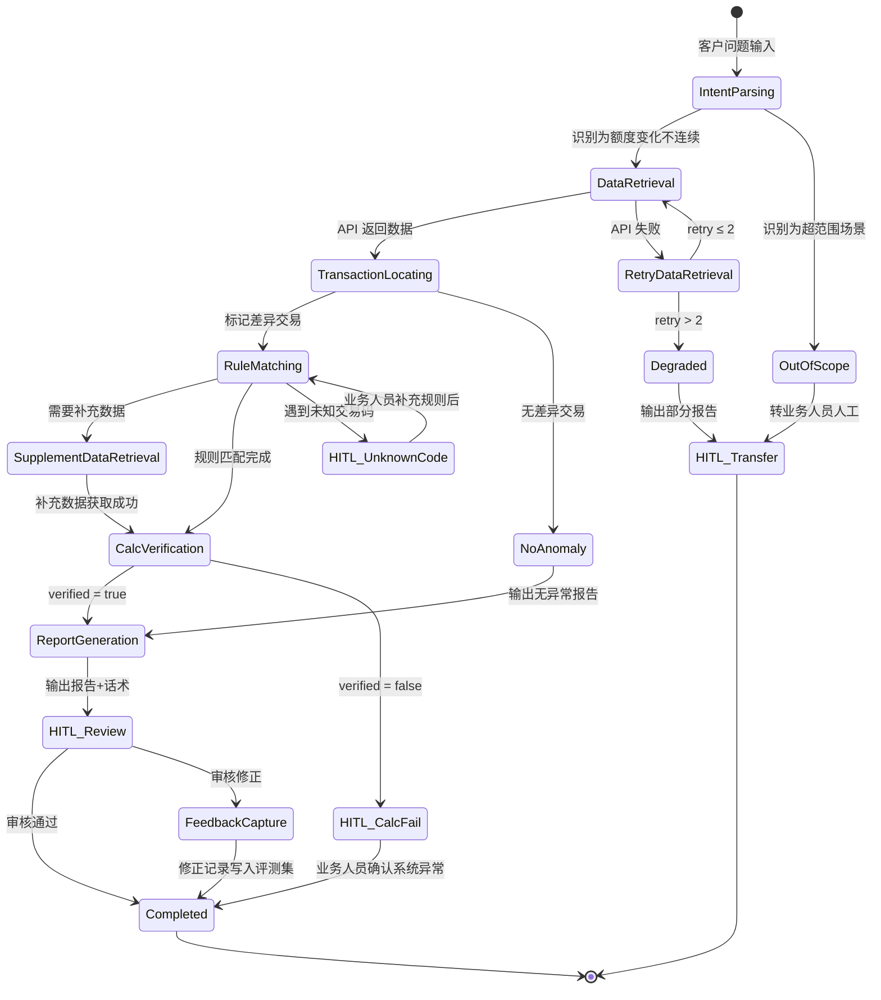

# Agent PRD: 额度异常排障 Agent (Limit Troubleshooting Agent)

**Status**: Draft
**Owner**: 额度产品团队
**Last Updated**: 2026-03-25
**Harness Quadrant**: Supervised Autonomy（MVP）→ Full Autonomy（目标态）

---

## 1. Problem & Business Context

### Problem Statement

额度产品业务方处理「可用额度变化不连续」类客诉时，需要跨多个系统（额度使用明细、CCA 运营管理、额度视图等）手动查询数据，人工匹配分散的业务规则（例如：识别交易码→额度恢复逻辑→溢缴款判定），再手动计算验证。单次排障涉及多个操作，其中 33% 是「检索知识库匹配规则」，强依赖个人经验。同类问题重复排障，知识复用率低。

### Success Definition (Business Level)

3个月内：额度产品业务方处理「额度变化不连续」类工单的平均排障时间从 [TBD: 当前基线，需业务方提供] 分钟降低至 5 分钟以内（Agent 自动输出根因分析 + 话术草稿，业务人员仅需审核确认）。

### Scope

**In scope（MVP）**:
- 指定账户、额度节点（消费额度、非循环专享消费分期额度等）的可用额度变化不连续排障
- 覆盖场景：客户指定时间区间内的交易→额度变动链路还原与解释
- 支持的额度变动因素：消费授权、消费入账、分期借方、分期贷方入、溢缴款等交易，对不同类型额度节点、不同占额成份的影响
- 输出：根因分析报告 + 客户解释话术草稿

**Out of scope（MVP）**:
- 多账户联动额度分析
- 境外交易缴款购汇、国际卡组织退货、无授权直接入账等特殊事件
- 临额/固额生效失效引起的额度变动
- 银行汇率参数调整引起的额度变动
- 授权交易过期引起的额度变动
- e招贷占用场景
- 一线客服直接使用

---

## 2. Harness Quadrant Assessment

| Axis | Rating | Evidence |
|------|--------|----------|
| Task Specification Clarity | Medium-High (7/10) | SOP 9 步流程明确，但 33% 步骤依赖隐性业务知识（4029/4306等入账交易、溢缴款余额对指定额度节点的可用额度的影响），需结构化后才能被 Agent 稳定执行 |
| Verification Automation | High (9/10) | 额度变化是纯数学逻辑：`可用额度变化 = f(交易金额, 业务规则, 系统参数)`，可通过对账公式完全自动验证 |

**Quadrant Position**: Autopilot 区（High Spec × High Verify）
**Recommended Autonomy Level**: MVP 阶段 → **Supervised Autonomy**；二期 → Full Autonomy

**Justification**: 验证环节的极高确定性（数学对账）抵消了业务规则匹配时的复杂性。但 Task Clarity 7 分反映业务规则覆盖率不完整（「业务规则文档分散不完整，依赖经验」—— q1.md F2）。MVP 阶段锁定 Supervised Autonomy，业务人员人员作为天然 HITL 兜底。当业务规则结构化覆盖率 ≥ 95% 且 Gold Dataset Pass@10 ≥ 90% 时，升级为 Full Autonomy。

### Prerequisites（升级 Full Autonomy 条件）

1. 高频交易码规则结构化覆盖率 ≥ 95%（以实际客诉涉及的交易码为分母）
2. Gold Dataset ≥ 50 个已结案复杂排障案例，Pass@10 ≥ 90%
3. 业务人员人均审核修正率 ≤ 10% 持续 4 周

---

## 3. Architecture Mode

**Selected Mode**: Single Agent

| Option | Pros | Cons | Selected? |
|--------|------|------|-----------|
| Single Agent | 简单、低延迟、7 工具在限额内、顺序型流程天然适配 | 单点故障、扩展新场景时可能触及工具上限 | **Yes** |
| Orchestrator + Workers | 可并行查询多数据源 | 排障流程是严格顺序型（后步依赖前步数据），并行收益低；协调开销大 | No |
| Critic Loop | 输出质量双重保障 | 验证已内嵌（数学对账），额外 Critic 是冗余，2× 延迟 | No |

**Decision rationale**: 排障流程是严格顺序型 DAG（r1.md 9 步逐步依赖），非并行场景。7 个工具（4 API + 3 Skill）在 ≤10 限额内。数学对账验证可内嵌为 Skill，无需独立 Critic Agent。MVP 阶段单 Agent 优先，摸清能力上限后再评估是否需要拆分。

---

## 4. Core Workflow

### Happy Path

```
客户问题输入（账户号 + 额度节点 + 问题描述 + 时间范围）
  ↓
Step 1: 意图识别与问题拆分 [内置能力]
  → 识别问题类型：额度变化不连续 / 单笔交易差异 / 客户APP交易展示限制
  → 提取关键参数：账户号、额度节点、时间范围、交易类型等
  ↓
Step 2: 数据检索 [Tool: query_limit_usage_detail]
  → 入参：账户号、额度节点类型、时间范围（扩大 ±3 天）
  → 出参：逐笔交易记录（交易时间、交易码、交易金额、可用额度前值、可用额度后值）
  ↓
Step 3: 定位问题交易 [Skill: transaction_continuity_check]
  → 逐笔计算：diff = 可用额度后值 - 可用额度前值 - 交易金额
  → 标记差异交易（diff ≠ 0 的交易）
  → 标记不连续点（前序交易后值 ≠ 后序交易前值）
  ↓
Step 4: 业务归因分析 [Skill: limit_change_rule_match]
  → 对每笔差异交易，识别交易码、交易账户、额度节点→业务含义→额度使用规则
  → 若需要补充数据 → Step 5
  → 若规则可直接解释 → Step 6
  ↓
Step 5: 补充数据检索（条件触发）[Tool: query_cca_transaction_detail（涉及额度视图、汇率历史等多个查询工具集合）]
  → 入参：客户号、交易时间、交易金额、交易类型、唯一参考号
  → 出参：单笔交易客户额度节点占额明细、汇率变化历史等
  ↓
Step 6: 计算验证 [Skill: limit_calculation_verify]
  → 用业务规则还原完整公式：expected = f(交易金额, 规则参数)
  → 对比：expected vs actual
  → 验证通过 → Step 7
  → 验证不通过 → [HITL: 标记为系统异常，转业务人员人工深度排查]
  ↓
Step 7: 生成根因分析 + 话术草稿 [内置能力]
  → 输出结构化根因报告 + 客户解释话术
  ↓
[HITL checkpoint: 业务人员审核确认]
  → 审核通过 → 交付
  → 审核修正 → 记录修正点反馈至评测集
```
> TODO:完善skill类型（1️⃣**query_cca_transaction_detail工具用途待定**）


### Key Branches

| Condition | Branch | Recovery Path |
|-----------|--------|---------------|
| API 返回空数据（无交易记录） | 提示扩大时间范围或确认账户号 | Agent 自动扩大 ±7 天重试 1 次，仍为空则输出「未找到交易记录」报告 |
| 交易码未在规则库中匹配到 | 标记为未知交易码 | 降级为数据报告模式：输出原始数据 + 已匹配部分 + 标记未匹配项，由业务人员人工补充 |
| 计算验证不通过（expected ≠ actual） | 标记为疑似系统异常 | 输出已还原的计算过程 + 差异点，转业务人员人工确认是否为系统 bug |
| 涉及 Out-of-scope 场景（境外交易等） | 识别并明确告知 | 输出「此场景超出当前 Agent 能力范围」+ 已收集的数据，转业务人员人工处理 |
| API 调用失败（超时/错误） | 重试（max 2 次） | 2 次失败后降级为部分数据报告，留痕记录失败 API + 错误信息 |

---

## 5. Human-in-the-Loop (HITL) Design

### HITL Policy

**Policy level**: Moderate（MVP 阶段所有输出需业务人员审核确认）
**Default escalation channel**: 内部排障工具界面通知 + HTTP callback

### HITL Checkpoint Table

| Checkpoint | Trigger Condition | Confidence Threshold | Human Decision Required | Timeout / Default |
|------------|-------------------|----------------------|------------------------|-------------------|
| CP-1: 未知交易码 | 交易码未命中规则库 | N/A（确定性触发） | 业务人员补充业务规则解释 | 4h → 工单标记「待规则补充」 |
| CP-2: 计算验证不通过 | expected ≠ actual 且差值 > 0.01 | N/A（确定性触发） | 业务人员判定是否为系统异常 | 4h → 工单升级至开发排查 |
| CP-3: 最终输出审核 | 每次排障完成 | N/A（MVP 阶段强制触发） | 业务人员确认报告准确性 + 话术可用性 | 8h → 工单标记「待审核」 |
| CP-4: Out-of-scope 检测 | 识别到境外交易/汇率变更/临额过期等超范围场景 | N/A（确定性触发） | 业务人员接管完整排障 | — |

### Escalation Flow（上报流程）

```
Agent 遇到 checkpoint（预设决策点） 触发条件
  → 格式化 escalation 消息：
    {问题摘要, 已收集数据, 已完成分析, 需要人工决策的具体点, 可选方案}
  → POST /api/escalation/{task_id}
  → 内部工具界面显示待处理任务
  → Wait {timeout}
  → If 审核通过: 标记完成，记录审核结果
  → If 审核修正: 记录修正内容 → 写入反馈集用于后续评测
  → If timeout: 标记为「待审核」，不自动交付
```

---

## 6. Toolchain Design

### Tool Inventory

| Tool Name | Category | Action Type | Description (ACI compliant) |
|-----------|----------|-------------|------------------------------|
| `query_limit_usage_detail` | Read | 查询额度使用明细 | **When**: 需要获取指定账户、额度节点在时间范围内的逐笔交易与额度变动记录时调用。**Not when**: 已有交易数据在上下文中。**Returns**: `{transactions: [{time, tx_code, amount, limit_before, limit_after, diff}]}` |
| `query_cca_transaction_detail` | Read | 查询 CCA 交易详情 | **When**: 需要补充单笔交易的 TCL 节点、冲抵金额等深层信息时调用。**Not when**: `query_limit_usage_detail` 返回的数据已足够解释差异。**Returns**: `{tx_detail: {tcl_node, pst_amt, offset_amount, ...}}` |
| `query_limit_view` | Read | 查询额度视图 | **When**: 需要确认客户当前各额度节点配置和额度值时调用。**Not when**: 排障仅涉及历史交易链路分析。**Returns**: `{limit_nodes: [{node_type, total, used, available}]}` |
| `query_actual_available_limit` | Read | 查询账户实际可用额度 | **When**: 需要确认客户当前实际可用额度（含所有影响因素）时调用。**Not when**: 仅分析历史额度变化。**Returns**: `{actual_available: number, factors: [...]}` |
| `skill_tx_continuity_check` | Skill | 交易连续性校验 | **When**: 拿到交易列表后，需要逐笔检查可用额度连续性、标记差异交易。**Trigger**: Step 3。**Returns**: `{anomalies: [{tx_index, type: "gap"|"diff", expected, actual, delta}]}` |
| `skill_limit_rule_match` | Skill | 额度规则匹配 | **When**: 对差异交易进行业务归因，匹配交易码→业务含义→额度恢复规则。**Trigger**: Step 4。**Returns**: `{matched_rules: [{tx_code, biz_meaning, limit_recovery_rule, explanation}], unmatched: [tx_codes]}` |
| `skill_limit_calc_verify` | Skill | 额度计算验证 | **When**: 规则匹配完成后，用公式验证 Agent 推导的额度变化是否与实际一致。**Trigger**: Step 6。**Returns**: `{verified: boolean, formula: string, expected: number, actual: number, diff: number}` |

**Total tool count**: 7 / 10 ✓

### ACI Compliance Check

- [x] 所有工具名称描述业务操作（`query_limit_usage_detail` 而非 `call_api_v2`）
- [x] 每个工具描述包含 "When" 和 "Not when"
- [x] 所有工具返回结构化 JSON（非原始 API 响应）
- [x] 错误响应需包含：type, message, suggestion, retryable（实现时强制）
- [x] 无功能重叠工具（4 个 Read 工具查询不同维度数据，3 个 Skill 执行不同分析逻辑）
- [x] 工具返回中不含框架元数据（retry_count, session_id, latency 不暴露给 Agent）

---

## 7. Context Structure Design

### Permanent Layer（system prompt, ≤500 tokens）

```
你是信用卡额度异常排障专家 Agent。

角色：根据客户描述的额度变化疑问，自动完成数据检索→交易定位→规则匹配→计算验证→根因报告生成。

输出格式：
1. 根因分析报告（结构化 JSON）
2. 客户解释话术（自然语言）

绝对约束：
- 禁止编造交易数据或业务规则，所有结论必须基于工具返回的实际数据
- 计算验证不通过时，禁止输出「已解释」，必须标记为「待人工确认」
- 遇到未知交易码，禁止猜测业务含义，必须触发 HITL
- 每步操作必须记录到排障日志

成功标准：Agent 推导的额度变化公式计算结果 = 实际额度变动值（误差 ≤ 0.01 元）
```

### On-Demand Skills 
> TODO:完善skill类型（1️⃣**tool wrapper**;2️⃣generator;**3️⃣reviewer**;4️⃣inversion;5️⃣**pipeline**）

| Skill | Trigger | Content Size |
|-------|---------|--------------|
| `tx_code_rule_library` | 遇到需要匹配交易码业务含义时 | ~800 tokens |
| `overpayment_logic` | 识别到贷方入账金额 > 欠款冲抵金额时 | ~400 tokens |
| `limit_recovery_rules` | 需要判定交易是否恢复额度时 | ~600 tokens |
| `explanation_template` | 生成客户解释话术时 | ~300 tokens |

### Runtime Injection（≤200 tokens per turn）

```xml
<runtime>
  <task_id>{排障任务 ID}</task_id>
  <customer_id>{客户号}</customer_id>
  <account_id>{账户号}</account_id>
  <account_type>{专享消费分期卡}</account_type>
  <limit_node>{消费额度/非循环专享消费分期额度}</limit_node>
  <time_range>{2025-12-20 ~ 2025-12-30}</time_range>
  <problem_description>{客户原始问题描述}</problem_description>
  <current_step>{当前排障步骤}</current_step>
</runtime>
```

### Memory Strategy

| Memory Type | Storage | When Written | When Read |
|-------------|---------|--------------|-----------|
| Working Memory（当前任务状态） | 任务状态文件（JSON） | 每个 Step 完成后 | 每个 Step 开始前 |
| Procedural Memory（规则库更新） | Skills 文件 | 业务人员人工补充未知交易码规则后 | 规则匹配时按需加载 |
| Error Memory（失败案例） | 评测集文件 | CP-2 触发（计算验证不通过）或 CP-1 触发（未知交易码）后 | 定期 eval 时批量加载 |

---

## 8. Harness Definition

### Acceptance Criteria (Verifiable)

| # | Criterion | Verification Method | Owner |
|---|-----------|---------------------|-------|
| AC-1 | Agent 推导的额度变化公式计算结果与实际额度变动值一致（误差 ≤ 0.01 元） | `skill_limit_calc_verify` 返回 `verified: true`；对 Gold Dataset 自动回归测试 | Agent 平台 |
| AC-2 | 所有差异交易均有业务归因（未知交易码必须触发 HITL，不允许跳过） | 排障日志校验：anomalies.length == (matched_rules.length + hitl_escalations.length) | Agent 平台 |
| AC-3 | 排障报告包含完整的计算推导过程（非仅结论） | 输出 schema 验证：report.formula 字段非空且包含每步数值 | Agent 平台 |
| AC-4 | 端到端排障延迟 ≤ 60 秒（不含 HITL 等待时间） | 任务日志 timestamp diff | SRE |

### Execution Boundary

- **Max retries per step**: 2（API 调用失败后重试 2 次，仍失败则降级）
- **Max end-to-end duration**: 120 秒（超时则中止并输出部分报告）
- **Permitted operations**: Read（查询所有数据接口）、Compute（数学计算验证）、Generate（生成报告和话术）
- **Forbidden operations**: Write（不修改任何业务数据）、Delete、发送外部通知（仅内部系统回调）

### Feedback Signal

- **Primary signal**: `skill_limit_calc_verify` 返回的 `verified` 字段 — 数学验证，非 Agent 自我声明
- **Secondary signal**: 业务人员审核结果（CP-3 checkpoint）— 人工确认业务解释准确性
- **Monitoring**: 排障任务日志（每步入参/出参/耗时/工具调用结果）→ [TBD: 日志平台/dashboard]

### Rollback Procedure

- **Trigger condition**: AC-1 验证失败 OR 执行超时 OR API 连续 3 次失败
- **Steps**:
  1. 停止当前排障流程，标记任务状态为 `degraded`
  2. 输出部分报告：已收集的原始数据 + 已完成的分析步骤 + 失败点描述
  3. POST /api/escalation/{task_id} 通知业务人员，附带完整排障日志
  4. 任务状态持久化，支持业务人员查看 Agent 已完成的工作后手动接续
- **Recovery time objective**: 降级报告在 5 秒内输出

---

## 9. Anti-Pattern Pre-Check

| Anti-Pattern | Risk Level | Status | Mitigation |
|---|---|---|---|
| 1. System prompt 当知识库 | **Med** | Mitigated | 业务规则（交易码规则库、溢缴款逻辑、额度恢复规则）全部封装为 on-demand Skills，system prompt ≤500 tokens 仅含角色+约束+输出格式 |
| 2. 工具数量失控 | **Low** | Mitigated | 7/10 工具，无功能重叠。二期扩展场景时若超 10 个，拆分为子 Agent |
| 3. 验证闭环缺失 | **Low** | Mitigated | 内嵌 `skill_limit_calc_verify` 数学对账；AC-1 通过外部计算验证，非 Agent 自我声明 |
| 4. 多 Agent 无边界 | **N/A** | Mitigated | MVP 为 Single Agent，不涉及多 Agent 状态管理 |
| 5. 记忆不整合 | **Med** | Mitigated | 排障中间状态外化到任务状态文件（JSON），不依赖上下文窗口传递；每步状态持久化支持断点恢复 |
| 6. 没有评测 | **High** | **At risk** | [TBD: 需收集 50+ Gold Dataset 已结案案例] → 失败案例立刻转 eval case；上线前要求 Pass@10 ≥ 90% |
| 7. 过早引入多 Agent | **Low** | Mitigated | MVP 锁定 Single Agent，先压榨单 Agent 上限 |
| 8. 约束靠期望不靠机制 | **Med** | Mitigated | 计算验证用代码执行（确定性），非 LLM 生成；输出 schema 用 JSON Schema 校验；未知交易码触发 HITL 是确定性分支，不靠 prompt 规则 |

---

## 10. Success Metrics

### Product-Level Metrics (Business Impact)

| Metric | Baseline | Target | Measurement Method |
|--------|----------|--------|--------------------|
| 单次排障平均耗时 | [TBD: 需业务方提供当前基线] | ≤ 5 min（含业务人员审核） | 工单系统：创建→关闭时间差 |
| 同类问题重复排障率 | [TBD] | 降低 50% | 工单标签聚类分析 |
| 额度产品业务方满意度（Agent 输出质量） | N/A（新功能） | ≥ 4.0 / 5.0 | 审核时内嵌评分 |

### Agent-Level Metrics (System Health)

| Metric | Definition | Target | Alert Threshold |
|--------|------------|--------|-----------------|
| Task Success Rate | AC-1~AC-3 全部通过且无 HITL 介入的任务占比 | ≥ 70%（MVP） | < 50% → 冻结部署 |
| Latency P95 | 端到端排障耗时（不含 HITL 等待） | ≤ 60s | > 120s → 排查性能瓶颈 |
| Human Intervention Rate | 触发任意 HITL checkpoint 的任务占比 | ≤ 30%（MVP） | > 50% → 检查规则库覆盖率 |
| Hallucination Rate | 业务人员审核标记为「Agent 结论错误」的任务占比 | ≤ 5% | > 10% → 冻结部署，排查根因 |
| Token Cost per Task | 单次排障消耗的平均 token 数 | ≤ 30k tokens | > 50k → 检查上下文设计 |
| Unknown Tx Code Rate | 触发 CP-1（未知交易码）的频率 | 逐月递减 | 连续 2 周上升 → 规则库专项补充 |

---

## 11. Connector Dependencies

| Category | Required? | Connected Tool | Fallback If Absent |
|----------|-----------|----------------|-------------------|
| 额度使用明细查询系统 | **Required** | MCP Tool: `query_limit_usage_detail` | Cannot proceed — blocker |
| CCA 运营管理系统 | **Required** | MCP Tool: `query_cca_transaction_detail` | 降级：仅基于额度使用明细数据分析，标记「需补充 CCA 数据」 |
| 额度视图查询 | Optional | MCP Tool: `query_limit_view` | Agent 跳过额度配置校验，仅分析交易链路 |
| 账户实际可用额度查询 | Optional | MCP Tool: `query_actual_available_limit` | Agent 跳过实时额度校验，仅分析历史链路 |
| 业务规则知识库 | **Required** | On-demand Skills（结构化文件） | 所有交易码均触发 HITL — Agent 退化为数据收集器 |

---

## 12. Implementation Path

### MVP — Supervised Autonomy

- **Scope**: 单账户/单额度节点的「可用额度变化不连续」排障，仅覆盖消费 + 分期入账 + 溢缴款 3 类场景
- **Autonomy level**: Supervised（CP-3 强制触发，所有输出需业务人员审核）
- **Harness**: AC-1（数学验证）+ AC-2（归因完整性）
- **Entry**: HTTP API，嵌入内部排障工具，业务人员按需调用
- **Model**: Qwen 系列，具体型号性能评测后确定
- **Retry**: 支持 /effort 级别重试机制，全链路操作留痕
- **Launch gate**: Gold Dataset ≥ 30 案例，Pass@10 ≥ 80%

### v2 — Expand Automation

- **Scope additions**: 临额/固额变更、授权交易过期、e 招贷占用场景
- **Autonomy upgrade**: CP-3 从强制触发改为抽检（10% 随机审核 + 异常触发审核）
- **New tools**: `query_temp_limit_history`、`query_auth_expiry`（+2 tools = 9/10）
- **Gate**: Human Intervention Rate ≤ 20% 持续 4 周，Hallucination Rate ≤ 3%

### v3 — Full Autonomy + 一线推广

- **Conditions**:
  - Pass@10 ≥ 95% 持续 8 周
  - Hallucination Rate ≤ 1% 持续 8 周
  - Human Intervention Rate ≤ 5%
- **Scope**: 一线客服可直接使用，Agent 输出直接交付客户（业务人员抽检兜底）
- **Architecture reassessment**: 若工具超 10 个，评估拆分为 Orchestrator + 场景 Workers

---

## Appendix A: 排障流程状态机



## Appendix B: 关键假设清单

| # | 假设 | 影响 | 状态 |
|---|------|------|------|
| A1 | 存量查询接口可通过 MCP Server 快速适配，无需重大改造 | 工具链可用性 | [待确认] |
| A2 | 高频交易码（4029/4306 等）覆盖了 MVP 场景 80%+ 的排障需求 | MVP 范围合理性 | [待确认] |
| A3 | 额度产品业务方愿意在内部工具中使用 Agent 辅助排障 | 用户采纳率 | [待确认] |
| A4 | Qwen 系列模型对中文信用卡业务领域的推理能力满足需求 | 模型选型可行性 | [待确认：需 benchmark] |
| A5 | 排障日志存储方案与现有日志平台兼容 | 可观测性落地 | [待确认] |
