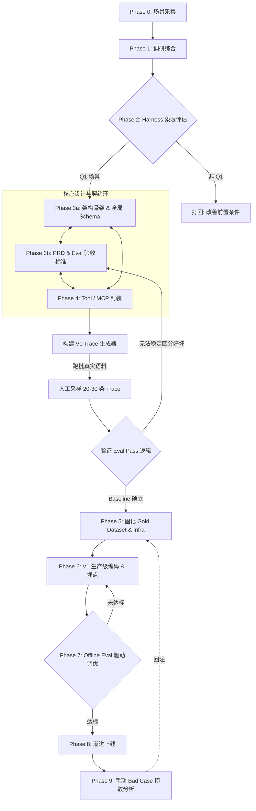

```mermaid
graph TD
    %% Discovery
    P0[Phase 0: 场景采集] --> P1[Phase 1: 调研综合]
    P1 --> P2{Phase 2: Harness 象限评估}
    P2 -- 非 Q1 --> Reject[打回: 改善前置条件]
    P2 -- Q1 场景 --> P3a

    %% Tightly Coupled Design Iteration Loop
    subgraph DesignLoop [核心设计与契约环]
        direction LR
        P3a[Phase 3a: 架构骨架 & 全局 Schema] <--> P3b[Phase 3b: PRD & Eval 验收标准]
        P3b <--> P4[Phase 4: Tool / MCP 封装]
        P4 <--> P3a
    end

    %% Minimal Viable Eval
    P4 --> V0[构建 V0 Trace 生成器]
    V0 -- 跑批真实语料 --> ManualSample[人工采样 20-30 条 Trace]
    ManualSample --> SanityCheck{验证 Eval Pass 逻辑}

    SanityCheck -- 无法稳定区分好坏 --> P3b
    SanityCheck -- Baseline 确立 --> P5[Phase 5: 固化 Gold Dataset & Infra]

    %% Execution & Scaling
    P5 --> P6[Phase 6: V1 生产级编码 & 埋点]
    P6 --> P7{Phase 7: Offline Eval 驱动调优}
    P7 -- 未达标 --> P6
    P7 -- 达标 --> P8[Phase 8: 渐进上线]
    P8 --> P9[Phase 9: 手动 Bad Case 捞取分析]
    P9 -. 回注 .-> P5
```
